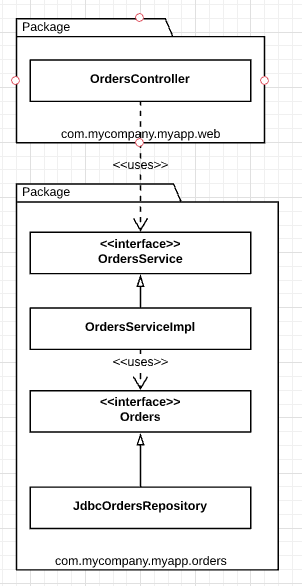

# Package by component

"Package by component" is about taking a *service-centric view* of a software system. In the same way that ports and adapters treat the web as just another delivery mechanism, it keeps the user interface separate from the coarse-grained components.

In essence, this approach *bundles up the "business logic" and persistence code into a single thing*, which we'll call a "component".

> Components are the unites of deployment. They are the smallest entities that can be deployed as part of a system (i.e, Java `.jar` files). - Uncle Bob

A "component" can also be defined as a:

> A component is a grouping of related functionality behind a nice clean interface, which resides inside an execution environment like an application. A software system is made up of one or more containers (e.g. web applications, mobile apps, stand-alone applications, databases, file systems), each of which contains one or more components, which in turn are implemented by one or more classes (or code). Whether each component resides in a separate jar file is an orthogonal concern.

A key benefit of this approach is that if you're writing code that needs to do something with `orders`, there's just one place to go, the `OrdersComponent`. Inside the component, the separation of concerns is still maintained, so the business logic is separate from data persistence, but that's a component implementation detail that consumers don't need to know about.

> Well-defined components in a monlithic application can be think of as a stepping stone to a micro-services architecture.
