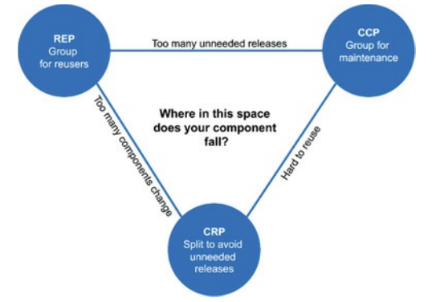

# Component Cohesion Principles

> Cohesion is a measure of the degree to which the elements of the module are functionally related. Basically, cohesion is the internal glue that keeps the module together.

Which classes and modules belong to which components is an important decision and requires guidance from good software engineering principles.

* [REP: Reuse/Release Equivalence Principle](./rep)
* [CCP: Common Closure Principle](./ccp)
* [CRP: Common Reuse Principle](./crp)

## Cohesion and Design Principles

Today we have a much more complex variety of cohesion that a module performs one, and only one, function.

> A good software design will have high cohesion.

In choosing the classes to group together into components, we must consider the opposing forces involved in reusability and develop-ability. Balancing these forces with the needs of the application is nontrivial. Moreover, the balance is almost always dynamic.

## Cohesion Principles Tension Diagram

The tree principles of component cohesion descrie a complex variety of cohesion. In choosing the classes to group together into components, we must consider the opposing forces in reusability/maintainability and develop-ability. Moreover, the balance is almost always dynamic. That is, the partitioning that is appropriate today might not be appropriate next year. As a consequence, the composition of components will likely jitter and evolve with time as the focus of the project changes from develop-ability to reusability/maintainability.