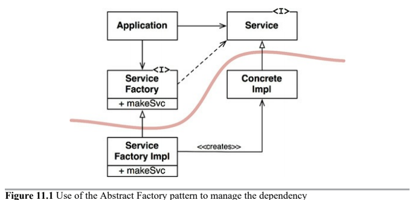

# Concrete Components

The concrete component contains a single dependency, so it violates the DIP. This is typical. DIP violations cannot be entirely removed, but they can be gathered into a small number of concrete components and kept separate from the rest of the system.

Most systems will contain at least one such concrete component, often called `main` because it contains the `main` function. In the case illustrated, the `main` function would instantiate the `ServiceFactoryImpl` and place that instance in a global variable of type `ServiceFactory`. The `Application` would then access the factory through that global variable.
