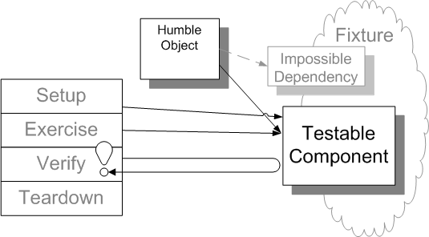

# The Humble Object Pattern

* Overview
* Example

## Overview

The *Humble Object* pattern is a design pattern that was originally identified as a way to help unit testers to separate behaviors that are hard to test from behaviors that are easy to test.

We extract all the logic from the hard-to-test component into a component that is testable via synchronous tests. This component implements a service interface consisting of methods that expose all the logic of the untestable component, the only difference is that they are accessible via synchronous method calls. As a result, the *Humble Object* component becomes a *thin adapter layer that contains very little code*.

This pattern is often applied at the boundaries of a system where logic is difficult to test due to framework dependencies or asynchronous code. Extracting this logic to a humble object decouples it from the boundary making those objects that interact with the boundary so humble they only need to be tested as part of the build process.

> The humble object will contain very little code, its only function will be to load the extracted component and delegate to it (for example, a third party library method). Therefore, the only tests needed to validate the humble object are to verify that the load and delegate functions work properly.

At each architectural boundary, we are likely to find the *Humble Object* pattern lurking somewhere nearby. The communication across that boudnary will almost always involve some kind of simple data structure, and the boundary will frequently divide something that is hard to test from something that is easy to test. *The use of this pattern at architectural boundaries vastly increases the testability of the entire system*.

> The whole idea is to make the complex or frequently changing layer as *humble* or thin as possible and exclude writing unit testing for that (since it will not be worth the effort you are putting into it). Concentrate on the business logic layer by having detailed testing on it.

## Example

For example, GUIs are hard to unit test because it is very difficult to write tests that can see the screen and check that the appropriate elements are displayed there. However, most of the behavior of a GUI is, in fact, easy to test. Using the *Humble Object* pattern, we can separate these two kinds of behaviors into two different classes called the `Presenter` and the `View`.
