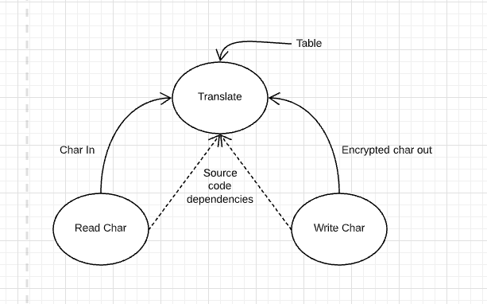
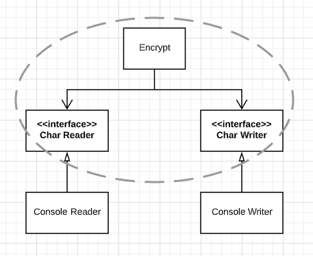
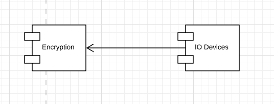

# Policy

* Overview
* Level
* Example: Simple encryption program

## Overview

> Software systems are statements of policy, a detailed description of the policy by which inputs are transformed into outputs.

Part of the art of developing a software architecture is carefully separating those policies from one another, and regrouping them based on the ways that they change.

> Policies that change for the same reasons, and at the same times, are at the same level and belong together in the same component.

Architecture often involves *forming the regrouped components into a directed acyclic graph*. The nodes of the graph are the components that contain policies at the same level. The directed edges are the dependencies between those components. They connect components that are at different levels.

In a good architecture, the direction of those dependencies is based on the level of the components that they connect. In every case, *low-level components are designed so that they depend on high-level components*.

## Level

Level is *the distance from the inputs and outputs*. The farther a policy is from both the inputs and the outputs of the system, the higher its level.

> The policies that manage input and output are the lowest-level policies in the system.

We want *source code dependencies to be decoupled from data flow and coupled to level*.

Keeping policies separate, with all source code *dependencies pointing in the direction of the higher-level policies*, reduces the impact of change. Trivial but urgent changes at the lowest level of the system have little or no impact on the higher, more important, levels.

> Lower-level components should be plugins to the higher-level components.

## Example: Simple encryption program

Suppose we have a simple encryption program that reads characters from an input device, translates them using a table, and then writes the translated characters to an output device.

The data flows are shown as curved solid arrows. The source code dependencies are shown as straight dashed lines.



The `Translate` component is the highest-level component in this system because it is the component that is farthest from the inputs and outputs.

It would be easy to create an incorrect architecture by writing the encryption program like this:

```cpp
function encrypt() {
    while(true)
        writeChar(translate(readChar()));
}
```

This is incorrect architecture because the high-level `encrypt` function depends on the lower-level `readChar` and `writeChar` functions.

A better architecture for this system would look like this:



Note the boundary surrounding the `Encrypt` class, and the `CharWriter` and `CharReader` interfaces. *All dependencies crossing start border point inward*. This unit is the highest-level element in the system. `ConsoleReader` and `ConsoleWriter` are low level because they are close to the inputs and outputs.

This structure decouples the high-level encryption policy from the lower-level input/output policies. This makes the encryption policy usable ina wide range of contexts. When changes are made to the input and output policies, they are not likely to affect the encryption policy.

> Policies that change for the same reasons and at the same time are grouped together by the *Single Responsibility Principle* and *Common Closure Principle*. Higher-level policies tend to change less frequently, and for more important reasons, than lower-level policies, which tend to change frequently, and with more urgency, but for less important reasons.

Trivial but urgent changes at the lowest levels of the system have little or no impact on the higher, more important, levels.



> Lower-level components should be plugins to the higher-level components.

The `Encryption` component knows nothing of the `IODevices` component. The `IODevices` component depends on the `Encryption` component.
