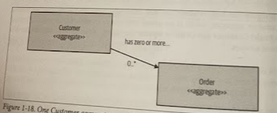
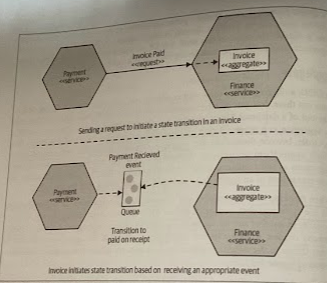

# Aggregate

## Overview

An *aggregate* is a representation of a real domain concept. Aggregates typically have a life cycle around them, which opens them up to being implemented as a state machine.

We want to treat aggregates as self-contained units; we want to ensure that the code that handles the state transitions of an aggregate are grouped together, along with the state itself.

An aggregate can have relationships with another aggregates.

## Microservice Architecture

In a microservice architecture, a single microservice will handle the life cycle and data storage of one or more different types of aggregates (e.g., Oder, Invoice, Stock Item, etc).

If functionality in another service wants to change one of these aggregates, it need to either directly request a change in that aggregate, or else have the aggregate itself react to other things in the system to inititate its own state transtions.

