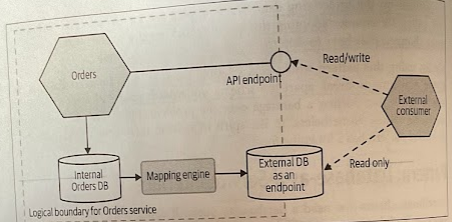

# Database-as-a-Service Interface

- [Database-as-a-Service Interface](#database-as-a-service-interface)
  - [Overview](#overview)
  - [Where to Use It](#where-to-use-it)
  - [Implementing a Mapping Engine](#implementing-a-mapping-engine)
  - [Compared to Views](#compared-to-views)
  - [Transferring Ownership](#transferring-ownership)

## Overview

Sometimes, client just need a database to query. It could be because they need to query or fetch large amounts of data, or perhaps because external parties are already using tool chains that require a SQL endpoint to work against (e.g., Tableu). In this cases we should take care to *separate the database we expose* from the database we use inside our service boundary.

One approach is to *create a dedicated database* designed to be exposed as *read-only* endpoint, and have this database populated when the data in the underlying database changes.

> Martin Fowler has already documented this approach under the name of *Reporting Database Pattern* but this reporting is not the only reason to use this technique, so a different name reflects the fact that it may have wider applicability.

* The *mapping engine* could ignore the changes entirely, expose the change directly, or something in between. The key thing is that the mapping engine acts as an **abstraction layer** between the internal and external databases.

* When internal database changes structure, the mapping engine will need to change to ensure that the public facing database remains consistent.

* The mapping engine *will lag behind writes* made to the internal database. Clients reading from the exposed database need to understand that they are therefore seeing *potentially stale data*.

> You may find it appropriate to programatically expose information regarding when the database was last updated.

## Where to Use It

* It is useful only for clients who need *read-only* access.

* It fits *reporting use cases* very well.

* Don't underestimate the work required to ensure that this external database projection is kept properly up-to-date.

## Implementing a Mapping Engine

The detail here is in working out *how to update*.

* A *change data capture system* is likely to be the most robust solution while also providing the most up-to-date view.

* A *batch-process* to copy the data over. Although this can be problematic as it is likely to lead to a longer lag between internal and external databases, and determining which data needs to be copied over can be difficult with some schemas.

* *Listen to events* fired from the service in question, and use that to update the external database.

## Compared to Views

* This pattern is *more sophisticated*. Database views are typically tied to a particular technology stack, but with this approach, the database we expose can be a totally different technology stack.

* This pattern gives you *more flexbility*, but an *added cost*. If the needs of your consumers can be satisfied with a simple database views, that is likely to be less work to implement in the first place but it can place restriction on how this interface can evolve.

## Transferring Ownership
