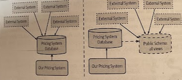
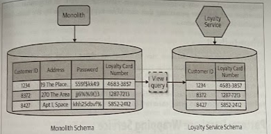

# Database View

## Overview

With a view, a service can be presented with a schema that is a *limited projection* from an underlying schema. This projection can limit the data that is visible to the service, hiding information it shouldn't have access to.

In situations where we want a single source of data for multiple services, **a view can be used to mitigate the concerns regarding coupling**.

### The Database as a Public Contract

Suppose you have multiple applications outside your control that have read access to our database, and in some cases read/write access. Unfortunately, all these external systems had been given the same username and password credentials, so it was impossible to understand who these users were, or what they were accessing.

If each actor (e.g., a human or an external system) has a different set of credentials, it becomes much easier to restrict access to certain parties, reduce the impact of revoking and rotating credentials, and better understan what each actor is doing.

In effect, our database schema had become a *public-facing contract* that couldn't change: we had to maintain the schema structure going forward.

## Where to Use It

You should consider views as a last resource for situations where it is impractical to decompose the existing monolithic schema.

## Views to Present

For all those clients who want to read data, we can create a *dedicated schema* hoisting views that looked like the old svhema, and had clients point at that schema instead. This allows you to make changes in our own schema as long as we could maintain the view.

> We define a view that exposes just the customer ID and the loyalty ID mapping in a single table, without exposing any other information in the customer table. Likeweise, any other tables that may be in the monolith's database are entirely hidden from the Loyalty service.

The abiliety of a view to protect only limited information from the unlderying source allows us to implement a form of *information hiding*. It gives us control over what is shared, and what is hidden.

Depending on the nature of the database, you may have the option to create a *materialized view*, in which the view is precomputed. This means a read from a view doesn't need to generate a read on the underlying schema. The trade-off then is around how this pre-computed view is updated (i.e., how you handle reading a "stale" set of data from the view).

## Limitations

Views typically are the result of a query, meaning that the view itself is *read-only*. This immediately limits their usefulness. In addition, not all NoSQL databases support views.

Even if your database engine support views, there will likely be other limitations, such as the need for both the source schema nad view to be in the same database engine. This could increase your *physical deployment coupling* leading to a potential single point of failure.

## Ownership

Changes to the underlying source schema may require the view to be updated, and so careful considerations should be given to who "owns" the view.

You could consider any published database views to be akin to any other service interface, and therefore something that should be kept up-to-date by the team looking after the source schema.
