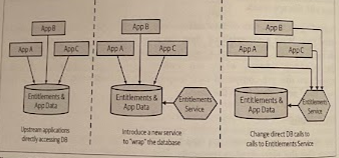
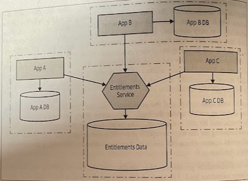

# Database Wrapping Service

- [Database Wrapping Service](#database-wrapping-service)
  - [Overview](#overview)
  - [Where to Use It](#where-to-use-it)

## Overview

We hide the database behind a service that acts as a thin wrapper, moving database dependencies to become service dependencies.

Sometimes, you accept that in the near term you will not be able to make changes to some systems, so it is imperative to at least *not make the problem any worse*. So we need to stop people from putting more data and behavior into a problematic schema. Once we've done that, we could consider removing those parts of the problematic schema that are easier to extract.

To achieve this, we introduce a service that allow us to "*hide*" the problematic schema. This service would have very little behavior at first, but the goal is to encourage the teams writing other applications to *think of the wrapped schema as someone else's*, and encourage them to store their own data locally.

Just as with our use of database views, the use of a wrapping service allows us to *control what is shared* and *what is hidden*. It presents an interface to consumers that can be fixed, while changes are made under the hood to improve the situation.

## Where to Use It

* The underlying schema is too hard to consider pulling part. By placing an explicit wrapper around the schema, and making it clear that the data can be accessed only through that schema, you at the very least can put a brake on the database growing any further.

* Stepping stone to more fundamental changes, giving you time to break apart the schema underneath your API layer.

* Upstream applications can more easily understand how they are using the downstream schema.

* Makes activities like stubbing for test purposes much more manageable.

* You aren't constrained to presenting a view that can be mapped to existing table structures; you can write code in your wrapping service to present much more sophisticated projections on the underling data.

* Wrapping service can take writes via API calls.

* It requires consumers to make changes; they have to shift from direct DB access to API calls.
