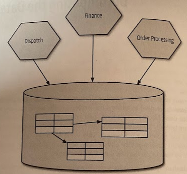

# The Shared Database

- [The Shared Database](#the-shared-database)
  - [Overview](#overview)
  - [Where To Use It](#where-to-use-it)
  - [Coping Patterns](#coping-patterns)

## Overview

Implementation coupling often ocupies us most when considering databases, because of the prevalence of people sharing a database among multiple schemas.

The major issue of sharing a single database among multiple services is that **we deny ourselves the opportunity to decide what is hared and what is hidden**. This means it can be difficult to understand what parts of a schema can be changed safely.

Knowing an external party can access your database is one thing, but not knowing what part of your schema they use is another.

> This can be mitigated through the use of *views*.

Another issue is that **it becomes unclear as to who "controls" the data**. Where is the business logic that manipulates this data? Is it now spread across services? That in turn **implies a lack of cohesion of business logic**. If the behavior that changes this state is now spread around the system, making sure this state machine can be properly implemented is a tricky issue.

> Microservices aim for high cohesion of business functionality, and all too often a shared database implies the opposite.

## Where To Use It

Direct sharing of database can be appropriate for a microservice architecture in two situations:

* *Read-only static reference data*: the data structure is highly stable, and change control of this data is typically handled as an administration task.

* A service is directly *exposing a database as a defined endpoint* that is designed and managed in order to handle multiple consumers.

## Coping Patterns

Although it can be a difficult activity, splitting the database apart to allow for each microservice to own its own data is nearly always preferred.

Sometimes the work involved will take too long, or involves changing especially sensitive parts of the system. In such cases, it can be useful to use a variety of *coping patterns* that will at the very least stop things from getting any worse, and at best can be sensible stepping stones toward something better in the future (e.g., *database view* pattern, or adopting the *database wrapping service* pattern).
