# Planning a Migration

- [Planning a Migration](#planning-a-migration)
  - [Summary](#summary)
  - [Prioritize](#prioritize)
  - [Changing Organizations (Kotter's 8 steps)](#changing-organizations-kotters-8-steps)
    - [1. Create a Sense of Urgency](#1-create-a-sense-of-urgency)
    - [2. Build a Guiding Coalition](#2-build-a-guiding-coalition)
    - [3. Form a Strategic Vision](#3-form-a-strategic-vision)
    - [4. Enlist a Volunteer Army](#4-enlist-a-volunteer-army)
    - [5. Enable Action by Removing Barriers](#5-enable-action-by-removing-barriers)
    - [6. Generate Short-Term Wins](#6-generate-short-term-wins)
    - [7. Sustain Acceleration](#7-sustain-acceleration)
    - [8. Institute Chnage](#8-institute-chnage)
  - [Importance of Incremental Migration](#importance-of-incremental-migration)
  - [It's Production That Counts](#its-production-that-counts)
  - [Cost of Change](#cost-of-change)
    - [Reversible and Irreversible Decisions](#reversible-and-irreversible-decisions)
    - [Easier Places to Experiment](#easier-places-to-experiment)
  - [Where Do We Start?](#where-do-we-start)
    - [Domain-Driven Design](#domain-driven-design)
    - [How Far Do You Have to Go?](#how-far-do-you-have-to-go)
    - [Event Storming](#event-storming)
    - [Using a Domain Model for Prioritization.](#using-a-domain-model-for-prioritization)
  - [A Combined Model](#a-combined-model)
  - [Reorganizing Teams](#reorganizing-teams)
    - [Shifiting Structures](#shifiting-structures)
    - [It's Not One Size Fits All](#its-not-one-size-fits-all)
    - [Making a Change](#making-a-change)
    - [Changing Skills](#changing-skills)
  - [How Will you Know if the Transition Is Working](#how-will-you-know-if-the-transition-is-working)
    - [Having Regular Checkpoints](#having-regular-checkpoints)
    - [Quantitative Measures](#quantitative-measures)
    - [Qualitative Measures](#qualitative-measures)
    - [Avoiding the Sunk Cost Fallacy (or Concorde Fallacy)](#avoiding-the-sunk-cost-fallacy-or-concorde-fallacy)
    - [Being Open to New Approaches](#being-open-to-new-approaches)

## Summary

Teams should ask themselves some key questions when deciding whether microservices are right for them:

* What are you trying to accomplish?
* Have you considered alternatives to using microservices?
* How will you know if the transition is working?

The importance of adopting an **incremental approach** cannot be overstated. Mistakes are inevitable, so if accepting that as a given, you should aim to make small mistakes rather than big ones.

The job isn't done until it's in production and is being used. You learn a huge amount from the process of having your first few services actually *used*. Early on, that needs to be your focus.

> We need to develop a series of techniques that allow us to create new microservices and integrate them with our (hopefully) shrinking monolith, and get them shipped to production.

## Prioritize

It's common for people to be trying to change not one thing but many things at once. You want to *avoid* this. This can lead to confusing priorities than can quickly increase the amoung of change needed and delay seeing any benefits.

It all starts innocently enough. After deciding microservices are the way forward. Someone else comes up and says, "well, if we're doing microservices, we can make our teams more autonomous at the same time!" Another person chimes in, "And this gives us a great chance to try out Kotlin as a programming language!" Before you know it, you have a massive change initiative that is attempting to roll out team autonomy, scale the application, and bring in new technology all at once, along with other things.

Moreover, microservices become locked in as *the* approach. If you focus on just the scaling aspect, during your migration you may come to realize that you'd better off just horizontally scaling out your existing monolithic application. But doing that won't help to the new secondary goals of improving team autonomy or brining a new programming language.

It is important, therefore, to *separate the core driver* behind the shift from any secondary benefits you might also like to achieve. Recognize that some things *are* more important than others.

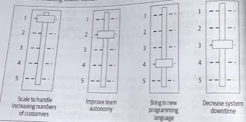

These relative priorities can change; and should change as you learn more. But they can help *guide decision-making*. Simple models like this can help inform local decision-making and make teams better choices that line up with what you're trying to achieve across the company.

You need to have a *shared understanding* about *what* you are trying to achieve. If you're on the same page about that and people disagree about an approach, then at least you know they're disagreeing only about *how* to get there.

## Changing Organizations (Kotter's 8 steps)

Dr. John Kotter's *8-step process* is used to instute large-scale organizational shifts in behavior.

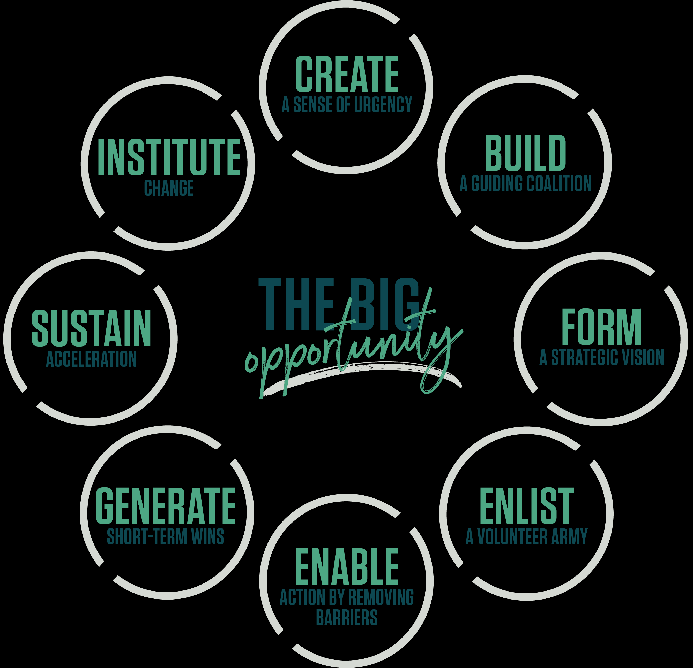

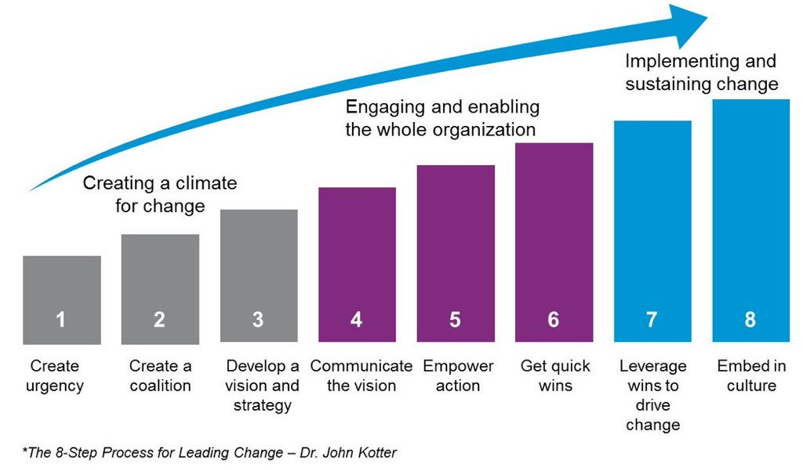

### 1. Create a Sense of Urgency

Help people understand that *now* the time to make this particular change. In the moments after a crisis has been dealt with, you have a brief moment in people's consciousness where pushing for change can work.

### 2. Build a Guiding Coalition

Identify the people inside your organization who can help you *drive* this change forward. Someone is much more likely to back your big idea if they've already worked with you on smaller, quick wins.

it's important to have involvement of people oustide software delivery/IT silos because many of the changes you make can potentially have significant impacts on how the software works and behaves. You'll need to make different trade-offs based on this.

### 3. Form a Strategic Vision

Make an agreement on *what* change you're hoping to bring (the *vision*) and *how* you're going to get there (the *strategy*). Vision needs to be realistic yet aspirational, and finding the balance between the two is key.

Microservices are going to achive the vision (you hope; they'll be part of your strategy). Remember that your strategy *may change*. Being committed to a vision is important, but being overly committed to a specific strategy in the face of contrary evidence is dangerous, and can lead to significant *sunk cost fallacy*.

> Having a big vision can be great, but don't make it so big that people won't believe it is possible.

### 4. Enlist a Volunteer Army

Large-scale change can only occur when massive numbers of people rally around a common opportunity. They must be bought-in and urgent to drive change – moving in the same direction.

> It’s not a project. It’s a movement. It’s a journey. Join us and leave your mark. - Gert Bosscher / Bunge

### 5. Enable Action by Removing Barriers

Removing barriers such as inefficient processes and hierarchies provides the freedom necessary to work across silos and generate real impact.

*Empowering employees* is management consultancy speak for helping them do their job. Most often this means something pretty straightforward, *removing road-blocks*.

> As a concrete example, when it comes to microservice adoption, the existing processes around provisioning of infrastructure can be a real problem. If the way your organization handles the deployment of a new product service involves placing an order for hardware several days in advance, then embracing technology that allows for the on-demand provisioning of virtualized execution environments could be a huge boon. But don't throw new technology into the mix for the sake of it.

Work with your organization, discover pain points, learn from that, and then invest time in briginig new tools. *Start small*.

### 6. Generate Short-Term Wins

> Wins are the molecules of results. They must be recognized, collected and communicated – early and often – to track progress and energize volunteers to persist.

Focusing initially on small, easy, low-hanging fruit will help *build momentum*.

When it comes to microservice decomposition, functionality that can easily be extracted from our monolith should be high on your list. You'll need to balance the ease of extraction of some pieces of functionality versus the benefit that will bring.

If you focus on something easy first, you're like to *gain insight early*. Making mistakes is natural, all we can do is structure things to make sure we learn from mistakes as quickly as possible.

### 7. Sustain Acceleration

Quick wins might be the only wins if you don't continue to *push on*. Pause and reflect after successes (and failures) so you can think about how to keep driving the change. We seek to *consolidate gains* and produce *more change*.

You may need to change your approach as you reach different parts of the organization.

### 8. Institute Chnage

Articulate the connections between the new behaviors and organizational success, making sure they continue until they become strong enough to replace old habits.

By continuing to iterate, roll out changes, and share the stories of successes (and failures), the new way of working will start to become business as usual.

it's all too often that once we've solved a hard problem, we just move on to the next. For change to *scale*, and *stick*, continually finding ways to share information inside your organization is essential.

## Importance of Incremental Migration

An incremental approach will help you learn about microservices as you go, and will also limit the impact of getting something wrong. By accepting that you will make mistakes, you realize you need a way to reduce the size of those mistakes.

Break the big journey into lots of little steps. Each step can be carried out and learned from. If it turns out to be a retrograde step, it was only a small one. Either way, you learn from it, and the next step you take will be informed by those steps that came before.

By splitting out microservices one at a time, you also get to unlock the value they bring incrementally, rather than having to wait for some big bang deployment.

Choose one or two areas of functionality, implement them as microservices, get them deployed into production, and reflect on whether it worked.

## It's Production That Counts

It is *really* important to note that the extraction of a microservice can't be considered complete until it is in production and being actively used.

> The vast majority of important lessons will not be learned until your service hits production.

Microservice decomposition can cause issues with troubleshooting, tracing flows, latency, referential integrity, cascading failures, and a host of other things.

## Cost of Change

### Reversible and Irreversible Decisions

* *Type 1 - Irreversible Decisions*: Irreversible or nearly irreversible, one-way doors. These decisions must be made methodically, carefully, slowly, with great deliberation and consultation.

* *Type  Reversible Decisions*: Most decisions. They are changeable, reversible, two-way doors. Those decisions can and *should* be made quickly by high judgement individuals or small groups.

> Based on Jeff Bezos, Letter to Amazon Shareholders (2015).

People who don't make decisions often may fall into the trap of treating Type 2 Decisions like Type 1 Decisions.

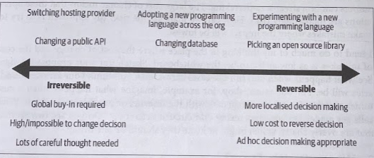

You need to **understand the impact if you decide to change your mind later**. The bigger the impact a later course correction will cause, the more it starts to look like an *Irreversible Decision*.

The reality is, the vast number of decisions you will make as part of a microservice transition will be toward the Reversible end of the spectrum.

### Easier Places to Experiment

Facing a large cost of change means that an operation is increasingly risky. To manage the risk, one approach is to make mistakes where the impact will be lowest.

## Where Do We Start?

We need to have some form of logical decomposition to work with, and this is where DDD come in handy.

### Domain-Driven Design

Each of these boujnded contexts represents a potential unit of decomposition. We have useful information in the form of the relationships between these bounded contexts too,, which can help us assess the relative difficulty in extracting the different pieces of functionality.

### How Far Do You Have to Go?

What we need from a domain model is *just enough* information to make a reasonable decision about where to start our decomposition. You probably have som ideas of the parts of your system that are most in need of attention, and therefore it may be enough to come up with a generalized model for the monolith in terms of high-level groupings of functionality, and pick the parts that you want to dive deeper into.

There is always a danger that if you look only at part of the system you may miss larger systemic issues that require addressing. I wouldn't obssess about it, you don't have to get it right first time; you just need to get enough information to make some informed next steps.

You can, and you should, *continuously refine* your domain model as you learn more, and keep it fresh to reflect new functionality as it's rolled out.

### Event Storming

*Event Storming* created by Alberto Brandolini is a collaborative exercise to define a shared domain model. It works from the *bottom up*. Participants start by defining *"Domain Events"*, things that happen in the system. Then these events are grouped into aggregates, and the aggregates are then grouped into bounded contexts.

The output of this exercise isn't just the model itself, it is the *shared understanding* of the model. For this process to work, you need to get the right stakeholders in the room, and often that is the biggest challenge.

### Using a Domain Model for Prioritization.

Based on the number of upstream or downstream dependencies, we can extrapolate a view regarding which functionality is likely to be easier, or harder, to extract.

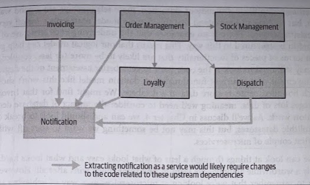

So Notification may not be a good place to start. On the other hand, Invoicing may well represent a much easier piece of system behavior to extract; it has no in-bound dependencies, which would reduce the required changes we'd need tyo make to the existing monolith.

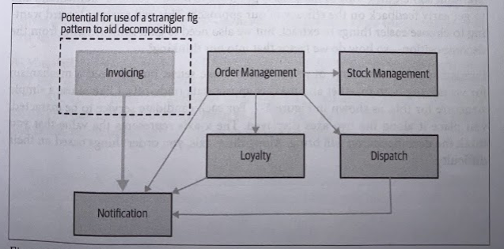

This domain model represents a *logical view* of an existing system. There is no guarantee that the underling code structure of the monolith is structured in this way. This means that our logical model can help us in terms of pieces of functionality that are likely to be more (or less) coupled, but we may still to look at the code itself to get a better assessment of the degree of entanglement of the current functionality.

We can and should look to break apart monolithic datastores, but this may not be something we want to start off with our first couple of microservices.

We need, therefore, to combine our view of what is easy and what is hard, together with our view of what benefits microservice decomposition will bring.

## A Combined Model

We want some quick wins to make early progress, to build a sense of momentum, and to get early feedback on the fficacy of our approach.

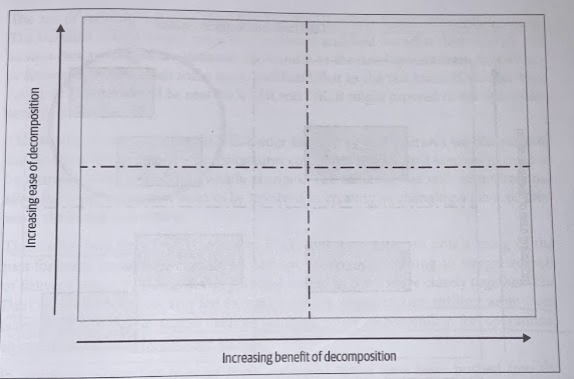

> A simple two-axis model for prioritizing service decomposition. Like every good quadrant model, ti's the stuff in the top right we like.

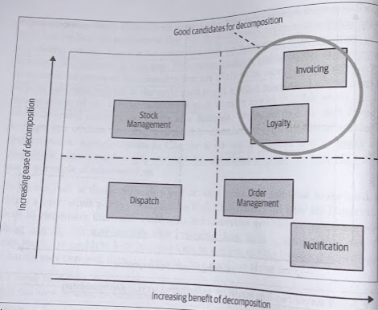

## Reorganizing Teams

### Shifiting Structures

Historically, IT organizations were structured around competency. When creating software, people from these teams would be assigned to work on often-short lived initiatives. The act of creating software therefore required multiple hand-offs between teams.

**Silos** have been breaking down. The *DevOps* movement has also led in part to many organizations shifting away from centralized operations teams, instead pushing for more responsibility for operational considerations onto the delivery teams.

The roles of dedicated teams have been pushed into the delivery teams and shifted. They've gone from doing the work themselves to helping the delivery teams do the work instead. Embedding specialists with the teams, creating self-service tooling, providing training, or a whole of other activities. Their responsibility has shifted **from doing to enabling**.

Increasingly, therefore, we're seeing more independent, autonomous teams, able to be responsibile for more of the end-to-end delivery cycle than ever before. **Their focus is on different areas of the product, rather than a specific technology or activity**.

### It's Not One Size Fits All

Making changes in your organizational structure is critical. Understanding if and how your organization needs to change needs to be based on your context, your working culture, and your people.

If you want to make a shift toward teams more fully owning the whole life cycle of their software, understand that the skills of those teams neeed to change.

> No matter what change you want to bring about, you can make this happen in an incremental fashion.

### Making a Change

1. Explicitly list all the activities and responsibilities that are involved in delivering software within the organization.
2. Map these activities to your existing organizational structure.
3. If you've already modeled your *path to production*, you could overlay those ownership boundaries on an existing view.

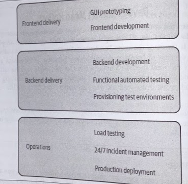

> The nature of a siloed organization is that you can struggle to understand what one silo does when you're in a different silo.

Once you have your *as-is picture*, redrwa thing with your vision for how things should be in the future, within some sensible timescale (six months to one year)

* What responsibilities are changing hands?
* How will you make that transition happen?
* What is needed to make that shift?
* What new skills will the teams need?
* What are the priorities for the various changes you want to make?

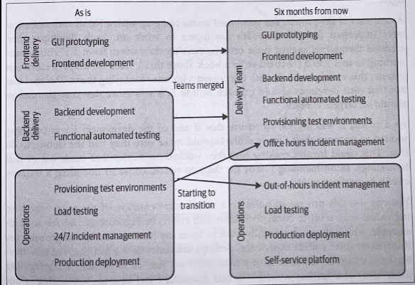

We want teams to be able to provision their own test environments. But to do that, the operations team will need to provide a self-service platform for the delivery team to use. They can also handle all incidents during the working day, giving them a chance to come up to speed with that process in a safe environment, where the existing operations team is on hand to coach them.

> Focusing on elimating the need for the operations team to provision test environments is the right first step.

### Changing Skills

You can have people self-assess and use that to build a wider understanding of what support the team mayh need to carry out the change. You can use this process to build up a visual representation of the areas where an individual may want to focus their time an effort.

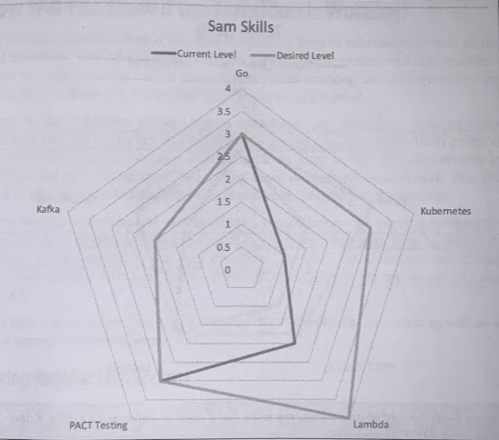

This might highlight the need for some group learning, and perhaps justify a bigger investment such as running an internal training course. Sharing this overall picture with your team can also help individuals understand how they can be part of heling the team as a whole find the balance it needs.

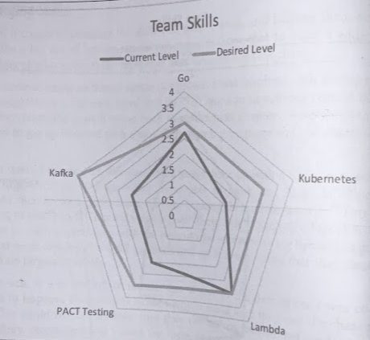

The right answer could be to bring new people into the team that have the skills you need. This could solve the short-term problem, and you then have an in-team export who can help their colleagues learn more in this area too.

## How Will you Know if the Transition Is Working

Based on the outcomes you are hoping to achieve, you should try defining some measures that can be tracked and can help you answer these questions.

### Having Regular Checkpoints

Build into your delivery process some time for pause and reflection in order to analyze the available information and determine whether a change of course is required. For small teams, this could be informal, or perhaps folded into regular retrospective exercises. For larger programs of work, they may need to be planned in as explicit activities on a regular cadence.

1. Restate what you are expecting the transition to microservices to achieve.
2. Review any quantitative measures you have in place to track progress.
3. Ask for qualitative feedback - do people think things are still working out?
4. Decide what, if anything, you're going to change going forward.

### Quantitative Measures

If you're focused on improving time to market, for example, measure cycle time, number of deployments, and failure rates make sense.

Some metrics can be hard to change in a short period of time. Introducing a change in how things are done often negatively impacts productivity in the short term, while the team comes up to speed with the new way of working.

### Qualitative Measures

Ignoring what your people are telling you in favor of relying entirely on quantitative metrics is a great way to get yourself into a lot of trouble.

### Avoiding the Sunk Cost Fallacy (or Concorde Fallacy)

*Sunk cost fallacy* occurs when people become so invested in a previous approach to doing something that even if evidence shows the approach isn't working, they'll still proceed anyway.

> Sometimes we justify it to ourselves: "It'll change any minute!" Other times we may have excreted so much political capital within our organization to make a change that we can't backpedal now.

If you make each step a small one, it becomes easier to avoid the pitfalls of the sunk cost fallacy. It's easier to change direction. Use the checkpoint mechanisms to reflect on what is happening.

### Being Open to New Approaches

the one certainity is that not everything will go smoothly, and you will need to be open to reverting changes you make, trying new things, or sometimes just letting this settle for a moment to let you see what impact it is having.
