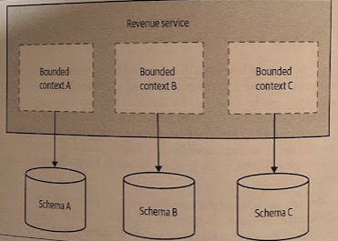

# Database per Bounded Context

- [Database per Bounded Context](#database-per-bounded-context)
  - [Overview](#overview)
  - [Where to Use It](#where-to-use-it)

## Overview

Once you've clearly isolated data access from application point of view, it makes sense to continue this approach into the schema. Before get to separating out the application code, we can start this decomposition by clearly separating our databases around the lines of our identified bounded contexts.

Each bounded context had its own, totally separate databases. The idea was that if there was a need to separate them into microservices later, this would be much easier.

## Where to Use It

At first glance, the extra work in maintaining the separate databases doesn't make much sense if you keep things as a monolith. It's a bit more work than a single database, but keeps your options open regarding moving to microservices later.

> Even if you never move to microservices, having the clear separation of schema backing the database can really help, especially if you have lots of people working on the monolith itself.

This pattern can be a *nice halfway point* instead of implementing microservices for new products or startups and having a single shared schema.

Keep schema separation where you think you may have service separation in the future. That way, you get some of the benefits of decoupling these ideas, while reducing the complexity of the system.
