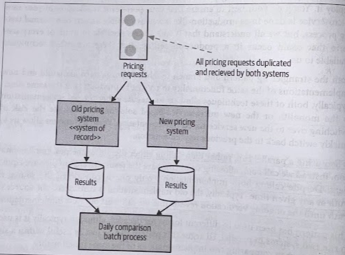
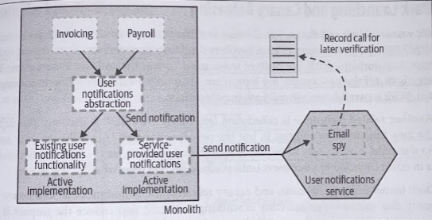

# Parallel Run

- [Parallel Run](#parallel-run)
  - [Overview](#overview)
    - [N-Version Programming](#n-version-programming)
  - [Where to Use It](#where-to-use-it)
  - [Verification Techniques](#verification-techniques)
    - [Using Spies](#using-spies)
    - [Dark Launching and Canary Releasing](#dark-launching-and-canary-releasing)

## Overview

> Both the *Strangler Fig* pattern and *Branch by Abstraction* pattern allow old and new implementations of the same functionality to *coexit* in production at the same time, but typically you can execute either the old implementation or the new service-based solution, therefore you can *mitigate the risk of switching* over to the new implementation by being able to quickly switch back to the previous implementation.

*Parallel run*, rather han calling either the old or the new implementation, you can call *both*, allowing us to compare the results to ensure they are equivalent.

Despite calling both implementations, *only one is considered the source of truth* at any given time. Typically, the old implementation is considered the source of truth until the ongoing verification reveals that we can trust our new implementation.

This technique can be used to verify not just that our new implementation is giving the same answers as the existing implementation, but that is also operating withing acceptable nonfunctional parameters.

### N-Version Programming

It could be argued that a *variation of parallel run* exist in certain safety critical control system, such as fly-by-wire aircraft:

Rather than relying on mechanical controls, airliners increasingly rely on digital control systems. When a pilot uses the controls, rather than this pulling cables to control the rudder, instead this sends inputs to control systems that decide how much to turn the rudder by. These control systems have to interpret the signals they are being sent and carry out the appropriate action.

Obviously, a bug in these control systems could be extremly dangerous. To offset the impact of defects,m for some situations *multiple implementations of the same functionality are used side by side*. Signals are sent to all implementations of the same subsystem, which then send their response. These results are compared and the "correct" one selected, normally by looking for a quorum among the participants. This is a technique known as *N-version programming*.

The end goal with this approach is not to replace any implementation. Instead, the alternative implementations will continue to exist alongside each other, with the alternative implementations hopefully reducing the impact of a bug in any one given subsystem.

## Where to Use It

Implementing a Parallel Run is rarely a trivial affair, and is typically reserved for those cases where the functionality being changed is considered to be high risk. The work to implement this needs to be traded off against the benefits you gain.

## Verification Techniques

We want to compare functional equivalence of the two implementations. We could treat both versions as functions: given the same inputs, we expect the same outputs. But we also can (and should) validate the nonfunctional aspects.

> GitHub's Scientist library is a set of tools for verifying code: https://github.com/github/scientist

### Using Spies

A *Spy* can stand in for a piece of functionality, stubbing it out, and allows us to verify after the fact that certain things were done.

Note that we could have decides to use the Spiy inside the monolith, and avoid our remote service notification code ever making a service call. However this is likely not what you want, as you actually do want to take into account the impact of the remote calls being made.

> You want to understand if time-outs, failures, or general latency is causing us issues.

One added complexity here is the fact that our Spy is running in a separate process, which will complicate when the verification process could be carried out.

> A common model for verification of *out-of-process* spies would be to record the interactions to allow for the verification to be done out of band, perhaps on a daily basis.

Obviously, if we were to use the Spy to replace the call to the Notifications service, the verification gets easier, but we're testing less. The more functionality you replace with a Spy, the less functionality is actually being tested.

### Dark Launching and Canary Releasing

A Parallel Run is *different* from what is traditionally called *Canary Releasing*. A canary release involves *directing some subset* of your users to the new functionality, with the bulk of your users seeing the old implementation. The idea is that if the new system has a problem, then only a subset of requests are impacted. With a Parallel Run, we call *both* implementations.

Another related technique is called *Dark Launching*. With dark launching, you deploy the new functionality and test it, but the new functionality is *invisible* to your users. So a Parallel Run is a way of implementing dark launching.

All these techniques fall under the banner of what is called **progressive delivery**, a term to describe methods to help control how software is rolled out to your users in a more nuanced fashion, allowing you to release software more quickly while validating its efficacy and reducing the impact of problems should they occur.

> *Progressive delivery* is an umbrella term coined by James Governor; you can the [blogpost](https://redmonk.com/jgovernor/2018/08/06/towards-progressive-delivery/).
