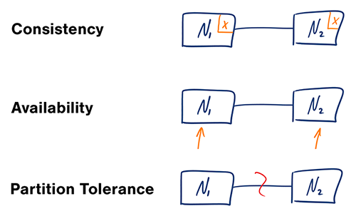
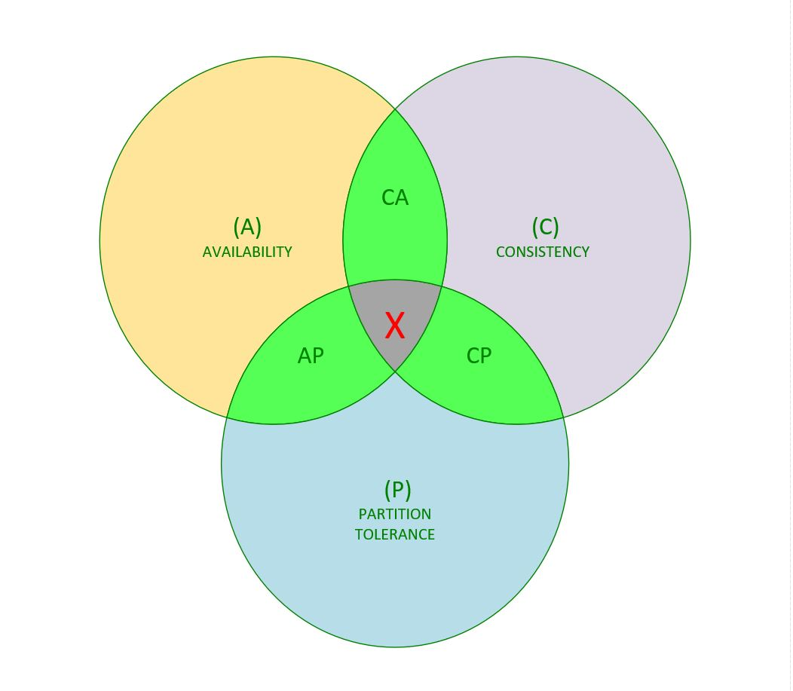
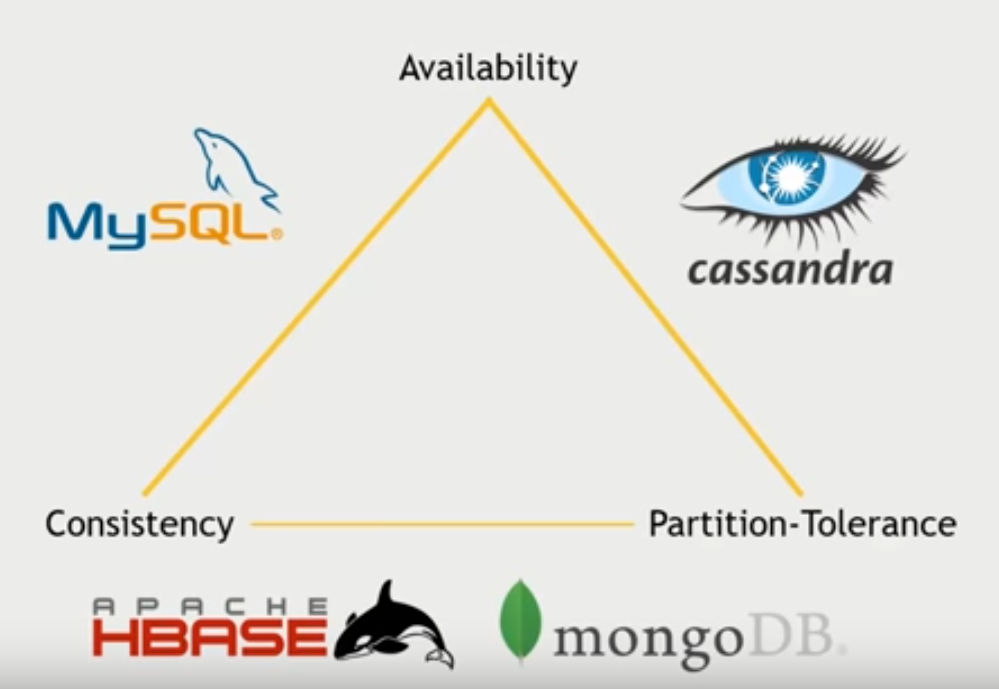

# CAP Theorem

> Recommended explanation: https://www.youtube.com/watch?v=k-Yaq8AHlFA

* Overview
* Classification
  * CP systems
* Well-known examples

## Overview

*CAP theorem*, also named *Brewer's theorem*, states that **is impossible for a distributed data system to simultaneously provide more than two** (CP vs AP) of the following three guarantees:

* **Consistency**: Every read receives the most recent write or an error.

* **Availability**: Every request receives a (non-error) response, without the guarantee that it contains the most recent write.

* **Partition tolerance**: A partition indicates a communication break between two nodes. The system continues to operate despite network partitions (i.e, arbitrary number of messages being dropped/delayed by the network between nodes).

> Note that *consistency* as defined in the CAP theorem is quite different from the consisteny guaranteed in **ACID** database transactions.

> Eric Brewer argues that the often-used "two out of three" concept can be somewhat misleading because system designers only need to sacrifice consistency or availability in the presence of partitions, and that in many systems partitions are rare.

CAP is frequently misunderstood as if one has to choose to abandon one of the three guarantees at all times. In fact, the choice is really between consistency and availability only when a network partition or failure happens; at all other times, no trade-off has to be made.

**When a network partition failure happens** should we decide to:

* Cancel the operation and thus decrease the availability but ensure consistency.
* Proceed with the operation and thus provide availability but risk inconsistency.

**In the absence of network failure** – that is, when the distributed system is running normally – **both availability and consistency can be satisfied**. 

## Classification

Nowadays, key-value stores are classified based on the two CAP characteristics they support.

Database systems designed with traditional **ACID** guarantees in mind such as RDBMS **choose consistency over availability**, whereas systems designed around the **BASE** philosophy, common in the NoSQL movement for example, **choose availability over consistency**.

> No distributed system is safe from network failures, thus network partitioning generally has to be tolerated.

### CP systems

System supports consistency and partition tolerance while sacrificing availability.

When choosing consistency over availability, the system **will return an error or a time out if particular information cannot be guaranteed to be up to date** due to network partitioning.

> CP is a good choice if your business needs require atomic reads and writes.

### AP systems

System supports availability and parition tolerance while sacrificing consistency.

When choosing availability over consistency, the system **will always process the query and try to return the most recent available version of the information**, even if it cannot guarantee it is up to date due to network partitioning. 

> AP is a good choice if the business needs allow for **eventual consistency** or when the system needs to continue working despite external errors.

### CA systems

System supports consistency and availability while sacrificing partition tolerance.

Since network failure is unavoidable, a distributed system must tolerate network partition. Thus, a CA system cannot exist in real-world applications.

## Well-known examples

