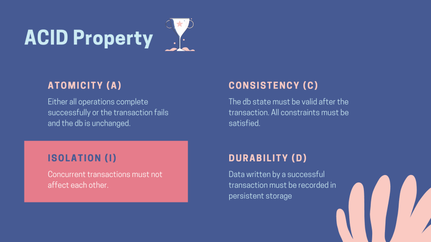

# ACID (Relational DBs)

- [ACID (Relational DBs)](#acid-relational-dbs)
  - [Overview](#overview)
  - [Atomicity](#atomicity)
  - [Consistency](#consistency)
    - [Data](#data)
    - [Reads](#reads)
  - [Isolation](#isolation)
  - [Durability](#durability)

## Overview

Set of properties of database _transactions_ intended to guarantee data validity despite errors, power failures, and other mishaps.

## Atomicity

* All queries must succeed. If one fails, all should rollback.

A guarantee of atomicity prevents updates to the database occurring only partially, which can cause greater problems than rejecting the whole series outright. As a consequence, the transaction cannot be observed to be in progress by another database client. At one moment in time, it has not yet happened, and at the next it has already occurred in whole (or nothing happened if the transaction was cancelled in progress).

## Consistency

### Data

* Defined by the user (views)
* Usually enforced by *Referential integrity* (foreign keys)
* Result of Atomicity & Isolation

### Reads

If a transaction committed a change, will a new transaction see the change immediately?

* Both relational and NoSQL databases suffer from this
* Eventual consistency

The moment you start using server replicas (horizontal scalability) you *will* suffer *inconsistency*, as secondary nodes will take time to get value propageted, so you might get an old value.

## Isolation

* Can my in-flight transaction see changes made by other transactions?
* Transactions as executed sequentially.
* Avoid/control *read phenomena* based on [isolation level](../isolation-levels/README.md).
  * *Dirty reads*: other transaction made a change, not commited yet, and I read that.
  * *Non-repeatable reads*: read a value commited, and in the same transaction, we read it again in another query, but this time it has a different value.
  * *Phantom reads*: insert a new record during a transaction not commited, and select that record.
  * *Lost updates*: you start to change something but not commited yet, and other transaction changes and commits another value.

Transactions are often executed concurrently (e.g., multiple transactions reading and writing to a table at the same time). Isolation ensures that concurrent execution of transactions leaves the database in the same state that would have been obtained if the transactions were executed sequentially.

Isolation is the main goal of concurrency control; depending on the method used, the effects of an incomplete transaction might not even be visible to other transactions.

## Durability

Committed transactions must be persisted in a __durable non-volatile storage__. 

For example, if you lose power, data should not be lost. E.g. Redis (cache) is not durable.
