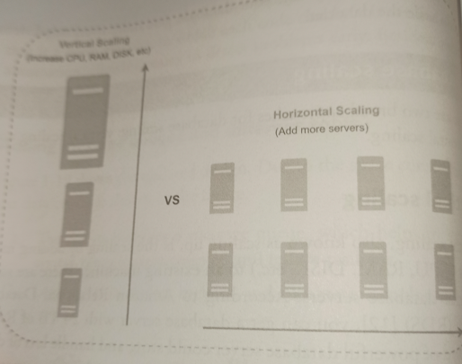
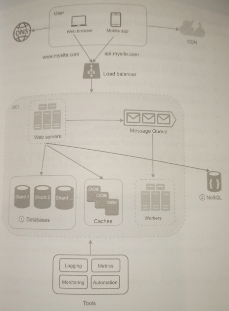
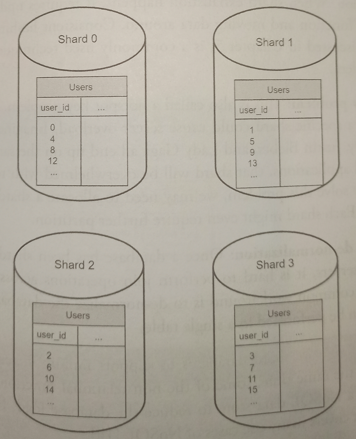
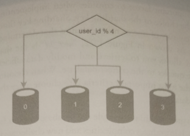

# Database scaling

There are two broad approaches for database scaling: *vertical* and *horizontal scaling*

## Vertical scaling (Scaling up)

Scaling by adding more power (CPU, RAM, DISK, etc) to an existing machine. There are powerful database servers, however, vertical scaling comes with some serious drawbacks:

* Hardware limits.

* Greater irsk of SPOF.

* Overall cost of vertical scaling is high, and usually much more expensive than horizontal scaling.

## Horizontal scaling (Sharding)

It is the practice of adding more servers. Sharding separates large databases into smaller, more easily managed parts called shards. Each shard **shares the same schema**, though the actual **data on each shard is unique** to the shard.

There are different techniques for sharding. For example, you could access user data based on user IDs. Anytime you access data, a hash function is used to find the corresponding shard (such as `user_id % 4` if you have 4 shards).

### Sharding Key

The most important factor to consider when implementing a sharding strategy is the choice of **the sharding key**, also known as **partition key**. One of the most important criteria is to **choose a key that can evenly distribute data**.

Sharding Key consists of one or more columns that **determine how data is distributed**. For example, `"user_id"` could be the sharding key.

A sharding key allows you to retrieve and modify data efficiently by routing database queries to the correct database. 

### Drawbacks

Sharding introduces complexities and new challenges to the system:

* **Resharding data**: Resharding nada is needed when a single shard could no longer hold more data due to a rapid growth, or certain shards might experience shard exhaustion faster than others due to an uneven data distribution. This requires updating the sharding function and moving data around. *Consistent hashing* is a commonly used technique to solve this problem.

* **Celebrity problem**: This is also called a **hotspot key problem**. Excessive access to a specific shard could cause server overload. Imagine data for Katy Perry, Justin Biever, and Lady Gaga all end up on the same shard. For social applications, the shard will be overwhelmed with read operations. To solve this problem, we may need to allocate a shard for each celebrity and each shard might even require further partition.

* **Join and de-normalization**. It is hard to perform join operations across database shards. A common workaround is to de-normalize the database so that queries can be performed in a single table. One approach is to move some of the non-relational functionalities to a NoSQL data store to reduce the database load.
