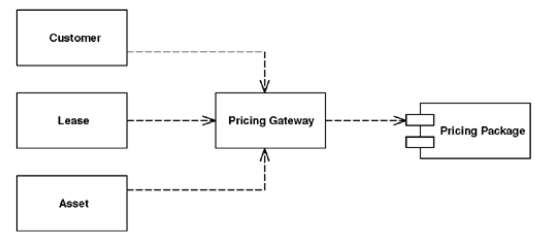

# Gateway

> An object that encapsulates access to an external system or resource.

* Overview
* How It Works
* When to Use It
  * Comparisons with *Facade*, *Adapter*, and *Mediator*.

## Overview

Anyone who needs to understand a resource needs to understand its API. Not only does this make the software harder to understand, it also makes it much harder to change should you shift some data, for example, from a relational database to an XML message at some point in the future.

*Gateway* wraps all the special API code into a class whose interface looks like a regular object. Other objects access the resource through this *Gateway*, which **translates the simple method calls into the appropriate specialized API**.

## How It Works

* Take the external resource and create a simple API for your usage, and use the *Gateway* to translate to the external source.

* You can often design a *Gateway* to make it easier to apply a *Service Stub*, making the system much easier to test.

## When to Use It

* Whenever you have an awkward interface to something that feels external, use *Gateway* to contain it.

* Make the system easier to test by setting clear points at which to deploy *Service Stubs*.

* You want to easily swap out one kind of resource for another. You would only have to alter the *Gateway* class

### Comparisons

* *Facade* simplifies a more complex API, but it's usually done by the writer of the service for general use. A *Gateway* is written by the client for its particular use. In addition, a *Facade* always implies a different interface to what it's covering, whereas a *Gateway* may copy the wrapped facade entirely, being used for substitution or testing purposes.

* *Adapter* alters an implementation's interface to match another interface you need to work with. With *Gateway* there usually isn't an existing interface, although you might use an *Adapter* to map an implementation to a *Gateway* interface. In this case, the *Adapter* might be part of the *Gateway* implementation.

* *Mediator* usually separates multiple objects so that they don't know about each other but do know about the *mediator*. With a *Gateway* there are usually only two objects involved and the resource that's being wrapped doesn't know about the *Gateway*.
