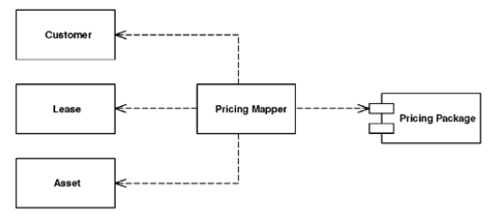

# Mapper

> An object that sets up a communication between two independent objects.

* Overview
* How It Works
* When to Use It

## Overview

Sometimes you need to set up communications between two subsystems that still need to stay ignorant of each other. This may be because you can't modify them or you can but you don't want to create dependencies between them.

## How It Works

* *Mapper* controls the details of the communication between them without either subsystem being aware of it.

* The complicated part is deciding how to invoke it, since it can't be directly invoked by either of the subsystems that it's mapping between. Something a third subsystem derives the mapping and invokes the mapper as well. An alternative is to make the mapper an *Observer* (Gang of Four) of one or the other subsystem.

* How a mapper works **depend on the kind of layer it's mapping**. The most common case is a *Data Mapper*.

## When to Use It

Essentially a *Mapper* decoupels different parts of a system. When you want to do this you have a choie between *Mapper* and *Gateway*. *Gateway* is much simpler to use.

You should only use a *Mapper* **when you need to ensure that neither subsystem has a dependency on this interaction**. The only time this is really important is when the interaction between the subsystems is particularly complicated and somewhat independent to the main purpose of both subsystems.

> Thus, in enterprise applications we mostly find *Mapper* used for interactions with a database, as in *Data Mapper*.

*Mapper* is similar to *Mediator* (Gang of Four) in that it's used to separate different elements. However, the objects that use a *Mediator* are aware of it.
