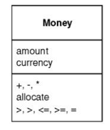

# Money

* Overview
* How It Works
* When to Use It

## Overview

Once you involve multiple currencies you want to avoid adding your dollars to your yen without taking the currency differences into account. The more subtle problem is with rounding. Monetary calculations are often rounded to the smallest currency unit. When you do this it's easy to lose pennies (or your local equivalent) because of rounding errors.

You can create a *Money* class that handles those kind of problems.

## How It Works

* Have a *Money* class with fields for the numeric amount and the currency.

* Decimal types are easier for some manipulations, and integral types for others. You should absolutely avoid using floating point type, as that will introduce the kind of rounding problems that *Money* is intended to avoid.

* *Money* is a *Value Object*, so it should have its equality and hash code operations overridden to be based on the currency and amount.

* *Money* needs arithmetic operations so that you can use money objects as easily as you use numbers.

* The algorithm used for converting from one currency to another can be encapsulated in a *convertor object*.

* *Money* can encapsulate the printing behavior, and can also parse a string to provide a currency-aware input mechanism.

* For storing a *Money* in a database can be done using an *Embedded Value*, which results in storing a currency for every money. That can be overkill when, for instance, an account may have all its entries be in pounds. In this case you may store the currency on the account and alter the database mapping to pull the account's currency whenver you load entries.

## When to Use It

You should use *Money* for pretty much all numeric calculation in object-oriented environments. You want to **encapsulate the handling of rounding behavior**, which helps reduce the problems of rounding errors.

Another reason to use *Money* is to make **multi-currency work much easier**.
