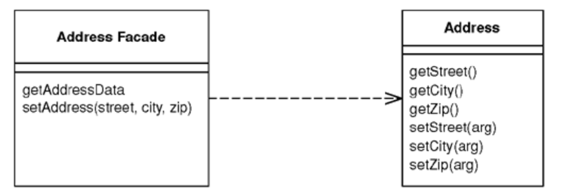
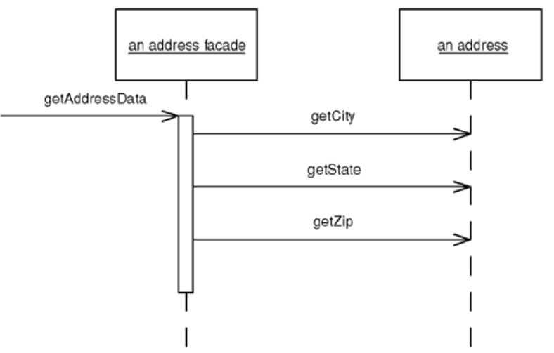
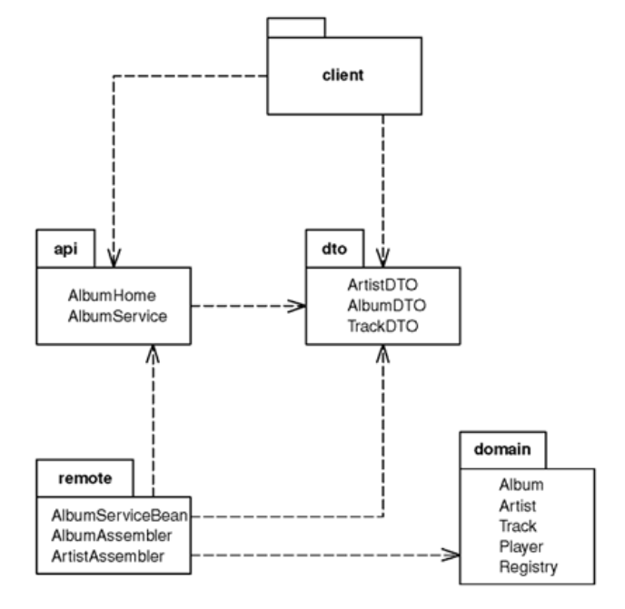

# Remote Facade

> Provides a coarse-grained facade on fine-grained objects to improve efficiency over a network.

* Overview
* How It Works
* When to Use It

## Overview

Remote calls are expensive: data may have to be marshaled, security may need to be checked, packets may need to be routed through swithces. Any inter-process call is orders of magnitude more expensive than an in-process call, even if both processes are on the same machine.

As a result, **any object that's intended to be used as a remote object needs a coarse-grained interface that minimizes the number of calls needed to get somethind one**.

A *Remote Facade* **provides a coarse-grained facade over a web of fine-grained object**. None of the fine-grained objects have a remote interface, and the *Remote Facade* contains no domain logic, all it does is translate coarse-grained methods onto the underlying fine-grained objects.

## How It Works

* **Any complex logic is placed in fine-grained objects** that are designed to collaborate within a single process, which is the standard object-oriented approach.

* To allow efficient access to them, **a separate facade object acts as a remote interface**. This facade is merely a thin skin that switches from a coarse-grained to a fine-grained interface. The facade **does not contain domain logic at all**.

* In a simple case, like an address object, a *Remote Facade* **replaces all the getting and setting methods with one getter and one setter**, often referred to as **bulk accessors**. This way all the logic of validation and computation stays on the address object where it can be factored cleanly and can be used by other fine-grained objects.

* In a more complex case, a single *Remote Facade* **may act as a remote gateway for many fine-grained objects**. For example, an order facade may be used to get and update information for an order, all its order lines, and mayne some customer data s well.

* The facade is designed to **make life simpler for external users**, not for the internal system.

* *Remote *Facade* can be **stateful or stateless**.
  * Stateless allows pooling, which can improve resource usage and efficiency, especially in a B2C situation.
  * Stateful requires storing session state somewhere using *Client Session State* or *Database Session State*, or an implementation of *Server Session State*.

## When to Use It

* Whenever **you need remote access to a fine-grained object model**. You gain the avantages of a coarse-grained interface while still keeping the advantage of fine-grained objects.

* The most common use of this pattern is between a *presentation* and a *Domain Model*, where the two may run on different processes.

* *Remote Facades* imply a synchronous style of distribution. Often you can greatly improve the responsiveness of an application by going with asynchronous, message-based remote communication.
