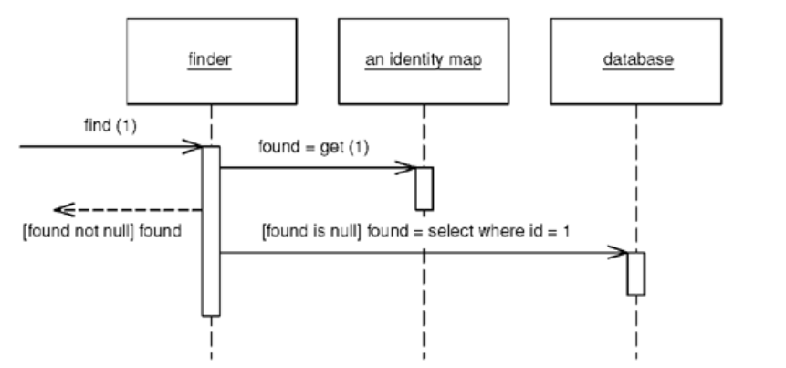

# Identity Map

> Ensures that each object gets loaded only once by keeping every loaded object in a map. Looks up objects using the map when referring to them.

* Overview
* How It Works
* When to Use It
* Design & Implementation
  * Choice of Keys
  * Explicit or Generic
  * How Many
  * Where to Put Them
* Example
  * Java

## Overview



An *Identity Map* keeps a record of all objects that have been read from the database in a single business transaction.

## How It Works

The basic idea is to have a series of maps containing objects that have been pulled from the database. In a simple case, with an isomorphic schema, you'll have one map per database table.

When you load an object from the database, you first check the map. If there's an object in it that corresponds to the one you're loading, you return it. If not, you go to the database, putting the objects into the map for future reference as you load them.

## When to Use IT

## Design & Implementation

### Choice of Keys

The obvious choice is the primary key of the corresponding database table, this works well if the key is a single column and immutable.

### Explicit or Generic

An *Explicit Identity Map* is accessed with distinct methods for each kind of object you need: such as `findPerson(1)`.

A *Generic Identity Map* uses a single method for all kinds of objects, with perhaps a parameter to indicate which kind of object you need, such as `find("Person", 1)`.

Your type of key affects the choice. You can only use a *Generic Identity Map* if all your objects have the same type of key. Otherwise, an *Explicit Identity Map* provides you with compile-time checking in a strongly typed language, and it has all the advantages of an explicit interface.

### How Many

The decision varies between **one map per class/table** and **one map for the whole session**.

### Where to Put Them

* *Identity Maps* need to be somewhere where they're easy to find.
* You need to ensure that each session gets it's own instance that's isolated from any other session's instance. Otherwise you need to provide transactional protection for your map.
  * *Unit of Work* usually works well for this.
  * Otherwise, the best bet is a *Registry* that's tied to the session.
  * You may use an object database as a transactional cache, even if you use a relational database for record data.

## When To Use It

* __Consistency__: In general, you use an *Identity Map* to manage any object brought from a database and modified. The key reason is that you don't want a situation where two in-memory objects correspond to a single database record. You might modify the two records inconsistently and thus confuse the database mapping.
  * It helps avoid update conflicts within a single session, but it doesn't do anything across sessions (Instead, you should use *Optimistic/Pessimistic Offline Lock*).

* **Cache**

## Example

### Java

```java
private Map people = new HashMap();

public static void addPerson(Person arg) {
  soleInstance.people.put(arg.getID(), arg);
}

public static Person getPerson(Long key) {
  return (Person) soleInstance.people.get(key);
}

public static Person getPerson(long key) {
  return getPerson(new Long(key));
}
```

> `long` isn't an object so you can't use it as an index for a map. This is troublesome if you want to retrieve an object with a literal which you often do in test code, so you can include a getting method that takes a `long` to make testing easier.

