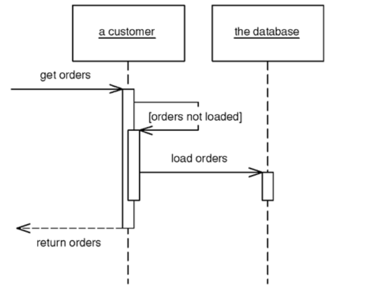

# Lazy Load

> An object that doesn't contain all of the data you need but knows how to get it.

* Overview
* How It Works
  * Problems
* When to Use It

## Overview

Loading an object can have the effect of loading a huge number of related objects (when only a few are actually needed).

A *Lazy Load* interrupts this loading process for the moment, leaving a marker in the object structure so that if the data is needed it can be loaded only when it is used.

## How It Works

* **Lazy Initialization**: Every access to the field checks first to see if it's `null`. If so, it calculates the value of the field before returning it (if `null` is a legal value field's value, then you need something else to signal that the field hasn't been loaded, or you need to use a *Special Case* for the `null` value). This tend to force a dependency between the object and the database, so it works best for *Active Record* or *Table/Row Data Gateway*.

* **Virtual Proxy**: An object that looks like the object that should be in the field, but only when one of its methods is called does it load the correct object from the database.

* **Value Holder**: An object that wraps another object. To get the underlying object you ask the value holder for its value, but only on the first access does it pull the data from the database.

* **Ghost**: The real object in a partial state. When you load the object from the database it contains just its ID. Whenever you try to access a field it loads its full state.

### Problems

* **Ripple Loading**: You fill a collection with *Lazy Loads* and then look at them one at a time, causing you to go to the database once for each object instead of reading them all in at once.
  * One way to avoid it is never to have a collection of *Lazy Loads* but, rather make the collection itself a *Lazy Load*, and when you load it, load all the contents.

* **Inheritance**: If you're going to use *ghosts* or *virtual proxies*, you'll need to know what type of ghost to create, which you often can't tell without loading the thing properly.

* **Varieties of lazyness**: Different use cases work best with different varieties of laziness. You can have separate database interaction objects for these. Thus, if you use *Data Mapper*, you may have two order mapper objects, one that loads the line items immediately and one that loads them lazily. The application code choose the appropriate mapper depending on the use case. A variation o n this is to have the same basic loader object but defer to a startegy object to decide the loading pattern.

## When to Use It

This is about deciding how much you want to pull back from the database as you load an object, and how many database calls that will require.

> In performance terms it's about deciding when you want to take the hit of bringing back the data.

Often it's a good idea to bring everything you'll need in one call so you have it in place, particularly if it corresponds to a single interaction with a UI.

The best time to use *Lazy Load* is **when it involves an extra call and the data you're calling isn't used when the main object is used**.
