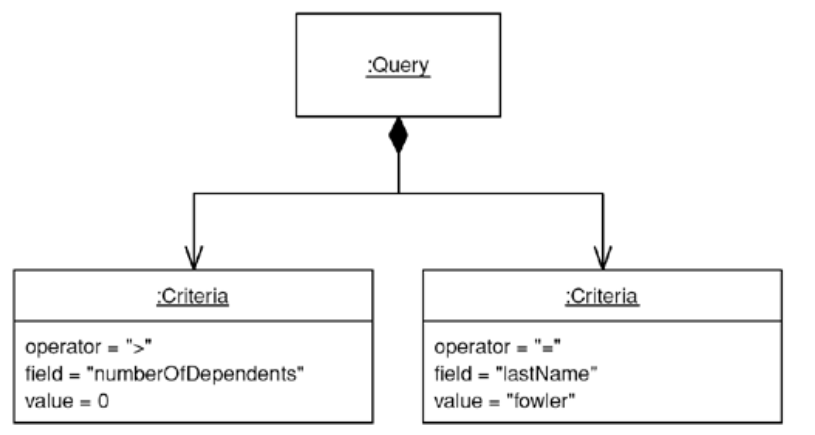

# Query Object

> "An object that represents a database query."

* Overview
* How It Works
* When to Use It

## Overview

A *Query Object* is an *Interpreter* (Gang of Four), that is, a structure of objects that can form itself into a SQL query. You can create this query by refering to classes and fields rather than tables an columns.

In this way those who write the queries can do so independently of the database schema and changes to the schema can be localized in a single place.

## How It Works

* *Query Object*'s primary roles are to allow a client to form queries of various kinds in the language of the in-memory objects rather than the database schema, and to turn those object structures into the appropriate SQL string.

* You can create a minimally funcitonal *Query Object* for your current needs and evolve it as those needs grows.

* A *Query Object* needs to know how the database structure maps to the object structure.

* A sophisticated use of *Query Object* is to eliminate redundant queries against a database.

## When to Use It

* You only need them when you're using *Domain Model* and *Data Mapper*; and you also need *Metadata Mapping* to make serious use of them.

* The advantaes of *Query Object* come with more sophisticated needs than just hiding details of the database schema:
  * Supporting multiple database and keeping their schemas encapsulated
  * Optimizing to avoid multiple queries
