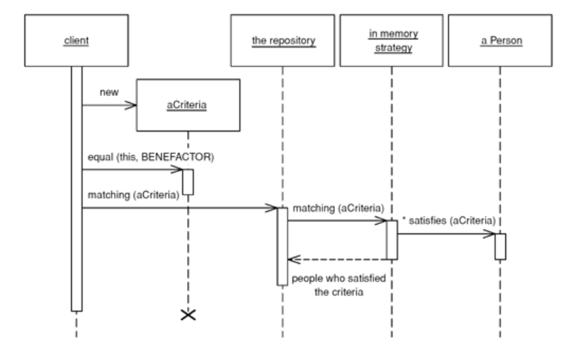

# Repository

> Mediates between the domain and data mapping layers using a collection-like interface for accessing domain objects.

* Overview
* How It Works
* When to Use It

## Overview

*Repository* is another **layer of abstraction over the data mapping layer** where query construction code is concentrated. This can be worthwhile to build when there are a large numer of domain classes or heavy querying, because it **helps minimize duplicate query logic**.

A *Repository* acts like an **in-memory domain object collection that mediates between the domain and data mapping layers**.

> *Repository* supports the objective of achieving a clean separationo and one-way dependency betwen the domain and the data mapping layers.

Client objects construct query specifications declaratively and submit them to *Repository* for satisfaction. Objects can be added to and removed from the *Repository*, as they can from a simple collection of objects, and the mapping code encapsulated by the *Repository* will carry out the appropriate operations behind the scenes.

> Conceptually, a *Repository* provdes a more **object-oriented view of the persistence layer**, encapsulating the set of objects persisted in a data store and the operations performed over them.

## How It Works

* Clients create a criteria object specifying the characteristics of the objects they want returned from a query.

* To code that uses a *Repository*, it appears as a simple in-memory collection of domain objects.

* Code that uses *Repository* should be aware that this apparent collection of objects might very well map to a product table with hundreds of thousands of records.

* Promotes the *Specification* pattern (in the form of the critia objects), which encapsulates the query to be performed in a pure object-oriented way.

* *Repository* replaces specialized finder methods on *Data Mapper* classes with a specification-based approach to object selection. With a *Repository*, client code constructs the criteria and then passes them to the *Repository*, instead of manually executing a *Query Object*. Thus, from client code's perspective, there's no notion of query "execution".

* Under the covers, *Repository* combines *Metadata Mapping* with a *Query Object* to automatically generate SQL code from the criteria. Whether the criteria know how to add themselves to a query, the *Query Object* knows how to incorporate criteria objects, or the *Metadata Mapping* itself controls the interaction is an implementation detail.

## When to Use It

* *Repository* reduces the amount of code needed to deal with all the querying that goes on in a system with many domain object types and many possible queries.

* Clients need never think in SQL and can write core purely in terms of objects. All code for setting up a *query object* in specific cases can be removed.

* Situations with multiple data sources.
  * For example, if we're interested in using a simple in-memory data store, commonly when we want to run a suite of unit tests entirey in memory for better performance.
  * Certain types of domain objects should be stored in memory (such as immutable objects).

* When a data feed is used as a source of domain objects (e.g. an XML stream, an `XMLFeedRepositoryStrategy` might be implemented that reads from the feed and creates domain objects from the XML).
