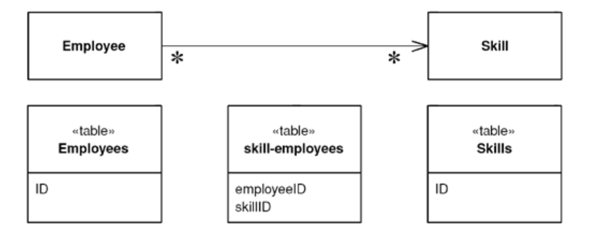

# Association Table Mapping

> Saves an association as a table with foreign keys to the tables that are linked by the association.

* Overview
* How It Works
* When To Use It

## Overview

Objects can handle multivalued fields quite easily by using collections as field values. Relational databases don't have this feature and are constrained to single-valued fields only.

When you're mapping a one-to-many association you can handle this using *Foreign Key Mapping*, essentially using a foreign key for the single-valued end of the association. But to **handle a many-to-many association** you can't do tihs, so the answer is the classic resolution of **reating an extra table to record that relationship**. Then use *Association Table Mapping* to map the multivalued field to this link table.

## How It Works

* Using a link table to store the association, that has only the foreign key IDs for the two tables that are linked together, it has one row for each pair of associated objects.

* To load data from the link table you perform two queries (at least conceptually). First find all the rows that link the tables, and then find the object for the related IDs for each row in the link table.

  * If all the information is already in memory, this scheme works fine. Otherwise it can be horribly expensive in queries.

  * You can join one of the tables with the link table, which allows you to get all the data in a single query, albeit at the cost of making the mapping a bit more complicated.

* Updating the link data involves many of the issues in updating a many-valued field. You can treat the link table like a *Dependent Mapping*. No other table should refer to the link table, so you can freely create and destroy links as you need them.

## When to Use It

* The canonical case is a **many-to-many association**, but it can also be used for any othe for mof association. However, it's more complex than *Foreign Key Mapping* and involves and extra join.

* It's appropriate for when you don't have control over the schema and you aren't able to add colmns to tables but need to link them.

* In a relational database design, association tables can also carry information about the company (e.g. person/company associative table that also contains information about a person's employment with the company). In this case the person/company table really corresponds to a true domain object.
