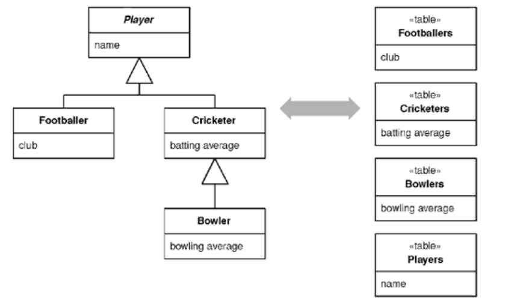
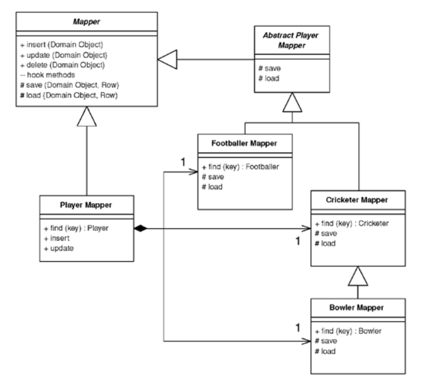

# Class Table Inheritance / Root-Leaf Mapping

> Represents an inheritance hierarchy of classes with one table for each class.

* Overview
* How It Works
* When to Use It
  * Advantages
  * Disadvantages

## Overview

You want database structures that map to objects and allow links anywhere in the inheritance structure.

*Class Table Inheritance* supports this by using **one database table per class in the inheritance structure**.

## How It Works

*Class Table Inheritance* has one table per class in the domain model. **The fields in the domain class map directly to the fields in the corresponding tables**. 

The fundamental approach of *Inheritance Mappers* applies. One issue is **how to link the corresponding rows of the database tables** (one domain object may need to get data from fields in the multiple tables depending on its inheritance chain).

One possible solution is to **use a common primary key value** so that, say, the row of key 101 in the footballers table and the row of key 101 in the playes table correspond to the same domain object. An alternative is to let each table have its own primary keys and **use foreign keys into the superclass table** to tie the rows together.

## When to Use It

*Class Table Inheritance*, *Single Table Inheritance* and *Concrete Table Inheritance* are the three alternatives to consider for inheritance mapping.

### Advantages

* All columns are relevant for every row; tables are easier to understand and don't waste space.

* Relationship between the domain model and database is very straightforward.

### Disadvantages

* To load an object, you need to touch multiple tables, which means a join or multiple queries.

* Any refactoring of fields up or down the hierarchy causes database changes.

* The supertype tables may become a bottleneck because they have to be accessed frequently.

* The high normalization may make it hard to understand for ad hoc queries.
