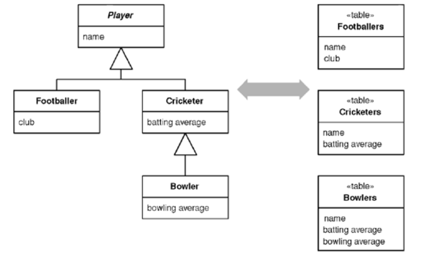
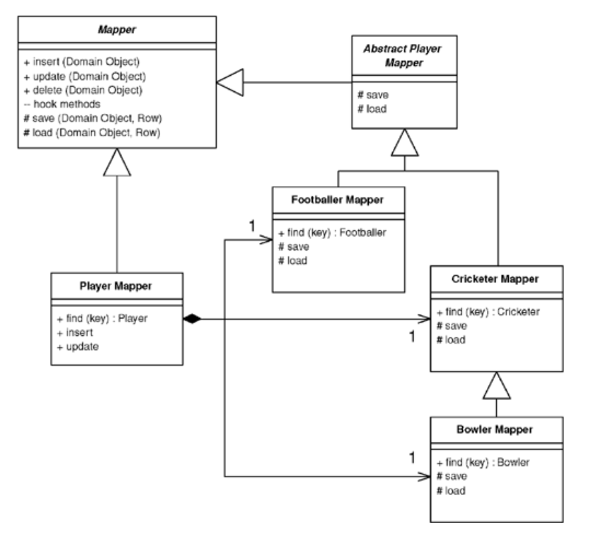

# Concrete Table Inheritance

> Represents an inheritance hierarchy of classes with one table per concrete class in the hierarchy.

* Overview
* How It Works
* When to Use It
  * Advantages
  * Disadvantages

## Overview

Take each object in memory and map it to a single database row. With *Concrete Table Inheritance*, there's **a table for each concrete class in the inheritance hierarchy**.

Most people think of it as a **leaf oriented** since you usually have **one table per leaf class** in a hierarchy. Strictly, however, a concrete class that isn't a leaf ususally gets a table as well.

## How It Works

*Concrete Table Inheritance* uses one database table for each concrete class in the hierarchy. **Each table contains columns for the concrete class and all it ancestors**, so any fields in a superclass are duplicated across the tables of the subclasses.

The basic behavior uses *Inheritance Mappers*. It's important to ensure that **keys are unique not just to a table but to all the tables from a hierarchy**.

> A classic example of where you need this is if you have a collectio nof players and you're using *Identity Field* with table-wide keys. If keys can be duplicated between the tables that map the concrete classes, you'll get multiple rows for a particular key value.

## When to Use It

*Class Table Inheritance*, *Single Table Inheritance* and *Concrete Table Inheritance* are the three alternatives to consider for inheritance mapping.

### Advantages

* Each table is self-contained and has no irrelevant fields. As a result it makes good sense when used by other applications that aren't using the objects.

* There are no joins to do when reading the data from the concrete mappers.

* Each table is accessed only when that class is accessed, which can spread the access load.

### Disadvantages

* Primary keys can be difficult to handle.

* You can't enforce database relationships to abstract classes.

* If the fields on the domain classes are pushed up or down the hierarchy, you have to alter the table definitions.

* If a superclass field changes, you need to change each table that has this field (because the superclass fields are duplicated across the tables).

* A find on the superclass forces you to check all the tables, which leads to multiple database accesses (or a weird join).
