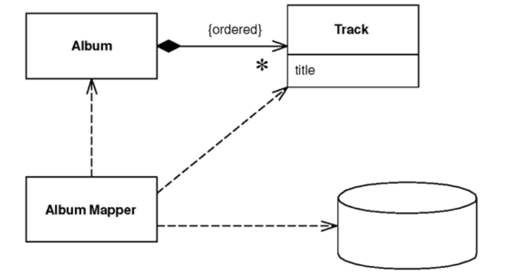

# Dependent Mapping

> Has one class perform the database mapping for a child class.

* Overview
* How It Works
* When to Use It

## Overview

Some objects naturally appear in the context of other objects.

> Tracks on an album may be loaded or saved whenever the underlying album is loaded or saved.

If they aren't referenced to by any other table in the database, you can simplify the mapping procedure by having the *one class mapper perform the mapping for other class aswell* (e.g. album warpper perform the mapping for the tracks too), treating this mapping as a *dependent mapping*.

## How It Works

The basic idea is that one class (the **dependent**) relies upon some other class (the **owner**) for its database persistence.

* For *Active Record* and *Row Data Gatewqay*, the dependent class won't contain any database mapping code; its mapping code sits in the owner.

* With *Data Mapper* there's no mapper for the dependent, the mapping code sits in the mapper for the owner.

* In *Table Data Gateway* there will typically be no dependent class at all, all the handling of the dependent is done in the owner.

* Dependents don't have an *Identity Field* and therefore ain't stored in a *Identity Map*. It therefore cannot be loaded by a ifnd method that looks up an ID (indeed, there's no finder for a dependent since all finds are done with the owner).

## When to Use It

* You use *Dependent Mapping* when you have an object that's only referred to by one other object, which usually occurs when one object has a collection of dependents.

* It helps to deal with the situation where the owner has a collection of references to its dependents but there's no back pointer.

* Dependent must have exactly one owner.

* There must be no references from any object other than the owner to the dependent.
