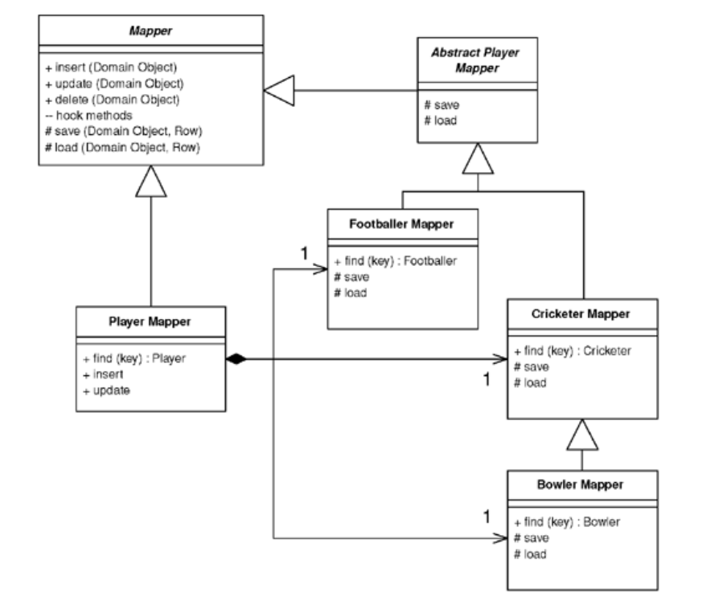

# Inheritance Mappers

> A structure to organize database mappers that handle inheritance hierarchies.

* Overview
* How It Works
* When to Use It

## Overview

When you map from an object-oriented inheritance hierarchy in memory to a relational database you have to minimize the amount of code needed to save and load the data to the database, and **provide both abstract and concrete mapping behavior that allows you to save or load a superclass or a subclass**.

## How It Works

* Each domain class can have a mapper that saves and loads the data for that domain class.

* The `find` method is implemented by a concrete mapper subclass because they it will return a concrete class. The basic behavior of the `find` method is to find the appropriate row in the database, instantiate an object of the correct type (a decision that's made by the subclass), and then load the object with data from the database.

* The `load` method is implemented by each mapper in the hierarchy which loads the behavior for its corresponding domain object.

* `insert` and `update` methods operate in a similar way using a `save` method.

* An abstract mapper is responsible for loading and saving the specific domain class data to the database.

  * This is an abstract class whose behavior is just used only by the concrete mapper objects.
  
  * A separate superclass mapper class is used for the interface for operations at the superclass level. It provides a `find` method and overrides the `insert` and `update` methods. For all of these its responsibility is to figure out which concrete mapper should handle the task and delegate to it.

## When to Use It

This general scheme makes sense for any inheritance-based database mapping.
