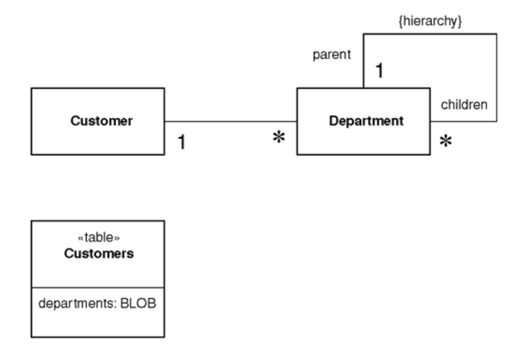

# Serialized LOB

> Savesd a graph of objects by serializing them into a single *Large Object* (LOB), whicvh it stores in a database field.

* Overview
* How It Works
* When to Use It

## Overview

Object models oftan contain complicated graphs of small objects which are not easy to put into a relational schema. Manipulating such a relational schema could require many joins, which are both slow and awkward.

 You can use *serialization*, where a whole graph of objects is **written out as a single _Large Object_ (LOB)** in a table. This *Serialized LOB* then becomes a form of *Memento*.

## How It Works

* **BLOB**: binary serialization
  * Simple to program and uses minimum of space.
  * Database must support a binary data type for it.
  * You can't reconstruct the graph without the object, so the field is utterly impenetrable to casual viewing.
  * If you change the class of the serialized object, you may not be able to readd all its previous serializations, so versioning can be compromised.

* **CLOB**: textual characters serialization
  * Serialize object graph into a text string that carries all the information you need.
  * Text string can be read easily by a human viewing the row.
  * Requires more space and is likely to be slower.

## When to Use It

This pattern works best when you can chop out a piece of the object model and use it to represent the LOB.

> Think of a LOB as a way to take a bunch of objects that aren't likely to be queried from any SQL route outside the application. This graph can then be hooked into the SQL schema.

*Serialized LOB* works poolry when you have objects outside the LOB reference objects buried in it.
