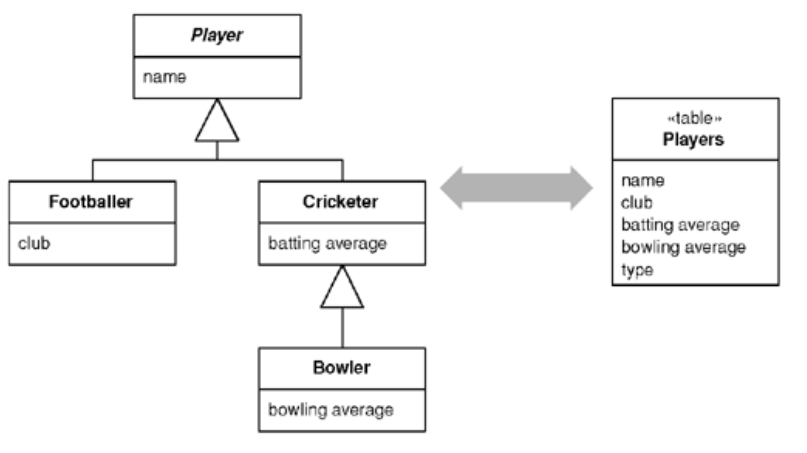
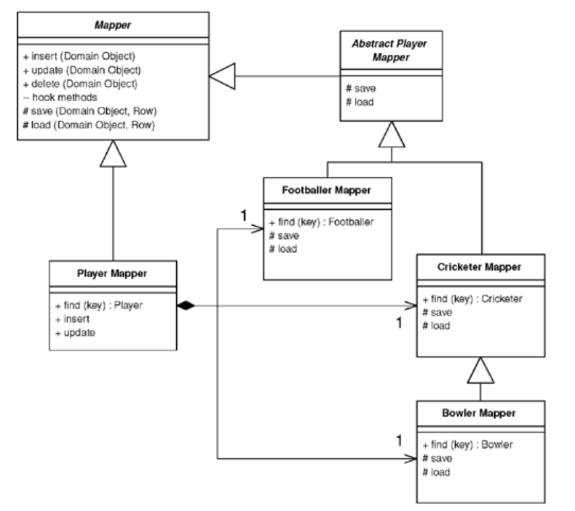

# Single Table Inheritance

> Represents an inheritance hierarchy of classes as a single table that has coclumns for all the fields of the various classes.

* Overview
* How It Works
* When to Use It
  * Advantages
  * Disadvantages

## Overview

When mapping from objects to databases we have to consider how to represent inheritance structures in relational tables.

We try to **minimize the joins** that can quickly mount up when processing an inheritance structure in mmultiple tables. *Single Table Inheritance* **maps all fields of all classes of an inheritance structure into a single table**.

## How It Works

In this inheritance mapping scheme we have **one table that contains all the data for all the classes in the inheritance hierarchy**. Each class stores the data that's relevant to it in one table row, and any columns that aren't relevant are left empty.

The basic mapping behavior follows the general scheme of *Inheritance Mappers*, so you have **a field in the table that indicates which class should be used**.

> A *code *field* needs to be interpreted by some code to map it to the relevant class, but it doesn't couple the class structure to the database schema as using the class name.

## When to Use It

*Single Table Inheritance* is one of the options for mapping the fields in an inheritance hierarchy to a relational database. The alternatives are *Class Table Inheritance* and *Concrete Table Inheritance*.

> You don't need to use one form of *inheritance mapping* for your whole hierarchy.

### Advantages

* Only a single table to worry about on the database.

* No joins in retrieving data.

* Any refactoring that pushes fields up or down the hierarchy doesn't require you to change the database.

### Disadvantages

* Fields are sometimes relevant and sometimes not.

* Columns used only by some subclasses lead to wasted space. Each database has its own tricks for leveraging this.

* The single table may end up being too large, with many indexes and frequent locking, which may hurt performance.
  
  * You can avoid this by having separate index tables that either list keys of rows that have a certain property or that copy a subset of fields relevant to an index.

* You only have a single namespace for fields.

  * Compund names with the name of the class can help.
