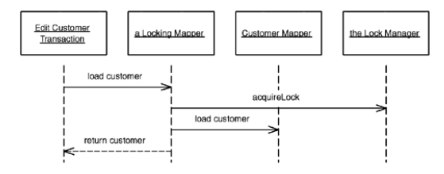

# Implicit Lock

> Allows frameworks or layer supertype code to acquire offline locks.

* Overview
* How It Works
* When to Use It

## Overview

Generally, if an item might be locked *anywhere* it must be locked *everywhere*. Ignoring its application's locking strategy allows a business transaction to create inconsistent data. Not releasing locks won't corrupt your record data, but it will eventually bring productivity to a halt. Because offline concurrency management is difficult to test, such errors might go undetected by all of your test suites.

One solution is **to not allow developers to make such a mistake**. **Locking tasks that cannot be overlooked should be handled implicitly by the application**.

*Layer Supertypes* and *code generation* provides us with opportunity to facilitate *Implicit Lock*.

## How It Works

* Factor your code such that **any locking mechanics that _absolutely cannot_ be skiped can be carried out by your application framework**.

* We should **implicitly acquire locks**. When we cannot do that, not having acquired a required lock by commit time is a programmer error and the code **should at least throw an assertion or concurrency exception**.

* While it allows developers to ignore much of the locking mechanics, it  doesn't allow them to ignore consequences. For example, pessimistic locking scheme that waits for lock can still face *deadlock* problems.

## When to Use It

*Implicit Lock* should be used in all but the simplest of applications that have no concept of frameworks. The risk of a single forgotten lock is too great.
