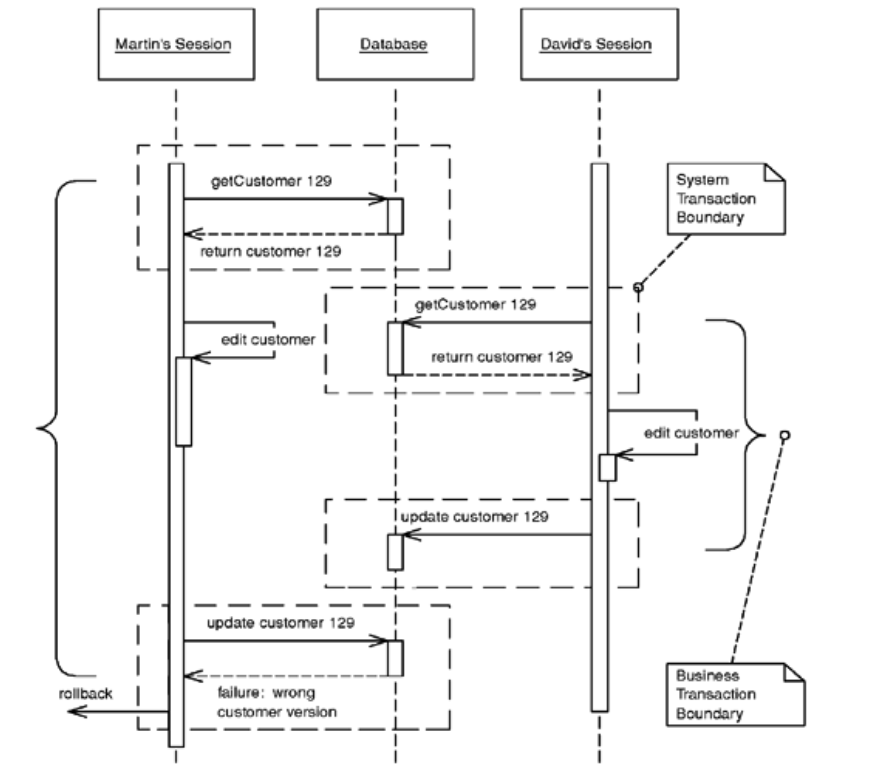
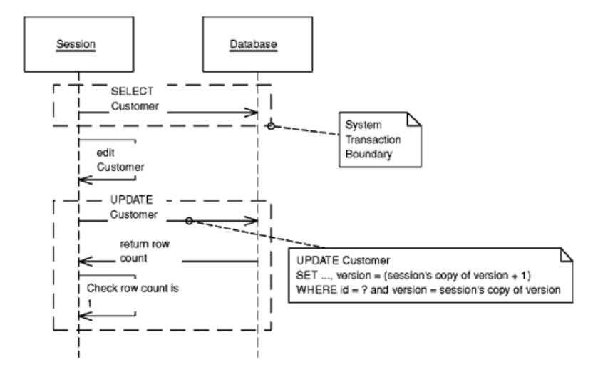

# Optimistic Offline Lock

> Prevents conflicts between concurrent business transactions by detecting a conflict and rolling back the transaction.

* Overview
* How It Works
* When to Use It

## Overview

*Optimistic Offline Lock* solves the problem of *lost updates* and *inconsistent reads* by **validating that the changes about to be committed by one session don't conflict with the changes of another session**.

A successful pre-commit validation is, in a sense, obtaining a lock indicating it's okay to go ahead with the changes to the record data. So long as the validation and the updates occur within a single system transaction, the business transaction will display consistency.

*Optimistic Offline Lock* **assumes that the chance of conflict is low**. The expectation that session conflict isn't likely allows multiple users to work with the same data at the same time.

> Source Code Management (SCM) system uses *Optimistic Offline Lock*. When it detects a conflict between programmers it usually can figure out the correct merge and retry the commit. A quality merge strategy makes *Optimistic Offline Lock* very powerful not only because the system's concurrency is quite high but because users rarely have to redo any work.

## How It Works

* An *Optimistic Offline Lock* **is obtained by validating that, in the time since a session loaded a record, another session hasn't altered it**. It can be acquired at any time but is valid only during the system transaction in which it is obtained.

> For a business transaction to not corrupt record data it must acquire an *Optimistic Offline Lock* for each member of its change set during the system transaction in which it applies changes to te database.

* The most common implementation is to **associate a version number with each record** in your system. When a record is loaded that number is maintained by the session. Getting the *Optimistic Offline Lock* is a matter of comparing the version stored in your session data to the current version in the record data. Once the verification succeeds, all changes, including an increment of the version, can be committed. **The version increment is what prevents inconsistent record data**, as a session with an old version can't acquire the lock.

* If the *Optimistic Offline Lock* fails to be obtained (e.g, the version of the current session doesn't match the one in the record data), **the business transaction must either abort or attempt to resolve the conflict and retry**.

## When to Use It

> The correct approach to concurrency management will maximize concurrenct access to data while minimizing conflicts.

* It is appropriate when **the chance of conflict between any two business transactions is low**. If conflicts are likely, it's not user friendly to announce one only when the user has finished his work and is ready to commit. In the last scenario, *Pessimistic Offline Lock* is would be more appropriate.

* Easier to implement and not prone to the same defects and runtime errors as *Pessimistic Offlien Lock*, so it's a **good default approach** to business transaction conflict management.

* It can be used to **know earlier if a conflict has ocurred**. You can provide a `checkCurrent` method that checks if anyone else has updated the data. It can't guarantee that you won't fail at commit time, but it may be worthwhile to stop a complicated process if you can tell in advance that it won't commit.
