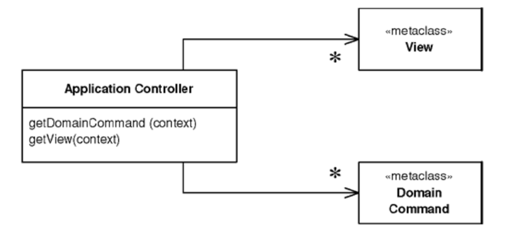
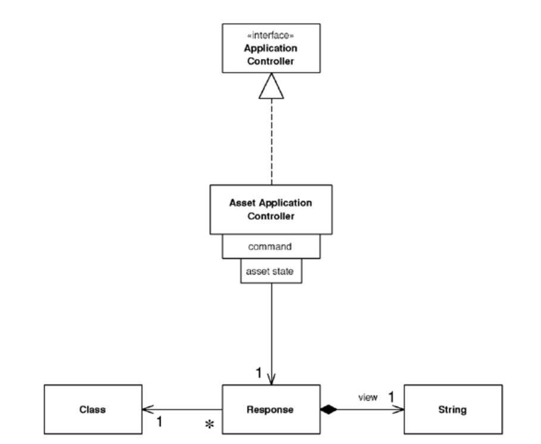

# Application Controller

> A centralized point for handling screen navigation and the flow of an application.

* Overview
* How It Works
* When to Use It

## Overview

In some applications, the user is led through a series of screens in a certain order. In other cases we may see screens that are only brought in under certain conditions, or chioces between different screens that depend on earlier input.

*Model View Controller*'s input controllers can make some of these decisions, but this can lead to duplicated code as application gets more complex. To avoid this duplication, __input controllers can ask an *Application Controller*for the appropriate commands__ for execution against a model __and the correct view__ to use depending on the application context.

An *Application Controller* has **two main responsibilities**:

* Deciding which domain logic to run.
* Deciding the view with which to display the response.

## How It Works

* Typically holds two structured collection of class references, one for domain commands and one of views.

* For the *application controller* to store what needs to be invoked, it can use *Commands* (Gang of Four), holding references to function, or holding strings that can be used to invoke methods by reflection.

* May or may not have links to the UI machinery. This will impact on how difficult is to test it. It's also important to isolate them if you want to support the same *Application Controller* with multiple presentations.

* An application can have multiple *Application Controllers* to handle each of its different parts, spliting up complex logic into several classes.

## When to Use It

The strength of an *Application Controller* comes from **definite rules about the order in which pages should be visited and different views depending on the state of objects**. If the flow and navigation of your application are simple enough so that anyone can visit any screen in pretty much any order, there's little value in an *Application Controller*.
