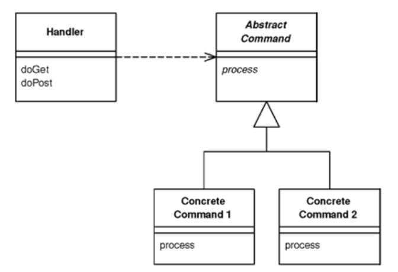

# Front Controller

> A controller that handles all requests for a Web site.

* Overview
* How It Works
* When to Use It

## Overview

In a complex Web site there are many similar things you need to do when handling a request (e.g., security, internationalization, providing particular views for certain users). If the controller behavior is scattered across multiple objects, much of this behavior can end up being duplicated and it's difficult to change at runtime.

The *Front Controller* **consolidates all request handling by channeling requests through a single handler object**. This object can carry out common behavior, which can be modified at run time with decorators. The handler then dispatches to command objects for behavior particular to a request.

## How It Works

* The *Front Controller* handles all calls for a Web site, and is usually structured in two parts: a *Web handler* and a *command hierarchy*.

  * The *Web handler* is the object that actually receives post or get requests from the Web server. It pulls just enough information from the URL and the request to decide what kind of action to initiate and then delegates to a command to carry out the action.

  * The *Commands* don't need any knowledge of the web environment, although they're often passed the HTTP information. It's responsible of carry out a requested action.

* *Intercepting Filter* pattern (described in *Alur et al*) can be useful to use in conjunction. It is essentially a decorator that wraps the handler of the *Front Controller* allowing you to build a **filter chain** (or pipeline of filters) to handle issues such as authentication, logging, and locale identification. Using filters allows you to dynamically set up the filters to use at configuration time.

## When to Use It

* Only one *Front Controller* has to be configured into the Web server; the Web handles does the rest of the dispatching. This **simplifies the configuration of the Web server**.

* With dynamic commands you can add new commands without changing anything. They also ease porting.

* Because you create new command objects with each request, you don't have to worry about making the command classes thread-safe.

* It allows you to **factor out code** that's otherwise duplicated in *Page Controller*.

* Being only one controller, you can **easily enhance its behavior at runtime with decorators**, and add them using a configuration file or even while the server is running.
