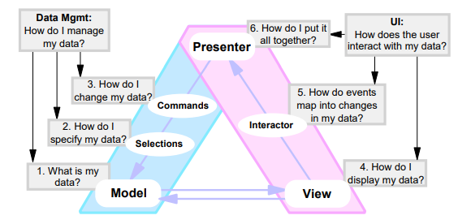
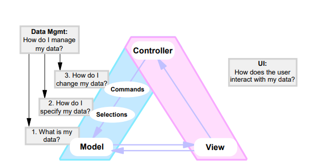
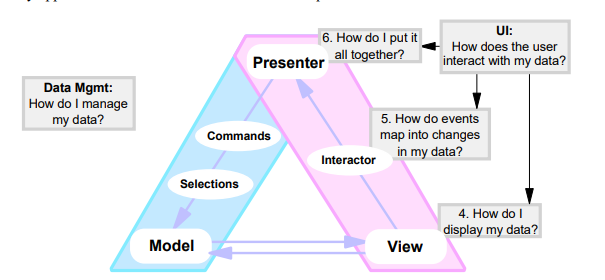
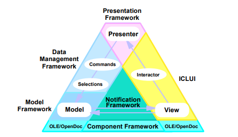
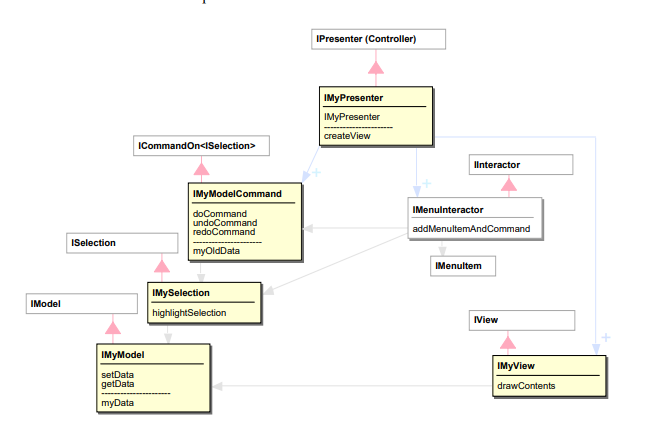
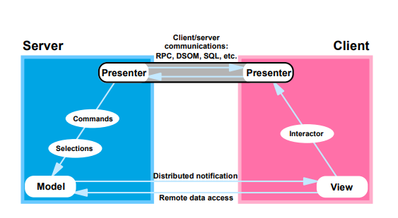
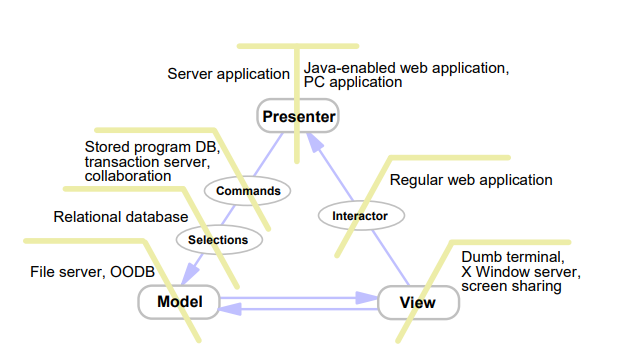

# Model View Presenter

> These notes are based on [Martin Fowler's GUI Architectures post](https://www.martinfowler.com/eaaDev/uiArchs.html) and [Potel paper](http://www.wildcrest.com/Potel/Portfolio/mvp.pdf). There's another interesting [paper](http://www.object-arts.com/papers/TwistingTheTriad.PDF) that I haven't consider yet from the developers of Dolphin Smalltalk.

- [Model View Presenter](#model-view-presenter)
  - [Overview](#overview)
  - [How It Works](#how-it-works)
  - [Potel vs Doplhin form](#potel-vs-doplhin-form)
  - [MVC Comparison](#mvc-comparison)
    - [Three User Interface Questions](#three-user-interface-questions)
  - [Programming Model Frameworks](#programming-model-frameworks)
    - [Programming Model Classes](#programming-model-classes)
  - [Client/Server](#clientserver)

## Overview

MVP is an architecture that first appeared in IBM and more visibly at Taligent during the 1990's.

MVP treats the *view* as a *structure of widgets* which doesn't contain any behavior that describes how the widgets react to user interaction. The *active reaction to user acts* lives in a separate *presenter* object. The fundamental handlers for user gestures still exist in the widgets, but **these handlers merely pass control to the presenter**.

> Potel discusses this interaction primarily in terms of *actions on the model*, which it does by a system of *commands* and *selections*. There's a useful approach of *packaging* all the edits to the model in a command - this provides a good foundation for providing undo/redo behavior.

The *presenter* decides how to react to the *event*. As the presenter *updates the model*, the *view* is updated through the same *observer synchronization* approach that MVC uses.

> The presenter *listens* to *events* and is able to get values from the actual widgets. At this point, the presenter decides whether or not to update the domain object, which widgets may observe and update as well.

## How It Works

> The role of the presenter within MVP is to interpret the events and gestures initiated by the user and provide the business logic that maps them onto the appropriate commands for manipulating the model in the intended fashion

* User gestures are handed off by the widgets to a [Supervising Controller](../supervising-controller).
* The presenter coordinates changes in a domain model.
* Different variants of MVP handle view updates differently (e.g., from *observer synchronization* to having the presenter handling all the view updates).

## Potel vs Doplhin form 

One of the variations about MVP is **the degree to which the presenter controls the widgets in the view**. On one hand there is the case where *all* view logic is left in the view and the presenter doesn't get involved in deciding how to render the model. **This style is the one implied by Potel**.

The direction behind **Dolphin Smalltalk** was towards what Martin Fowler describes as [Supervising Controller](../supervising-controller), where the view handles a good deal of the view logic that can be described declaratively and the presenter then comes in to handle more complex cases.

## MVC Comparison

Classic MVC doesn't work well with modern rich client tools because they design things so that the *view handles all the user events* such as mouse and keyboard clicks. In MVP the view continues to handle these, but then *immediately delegates these to the presenter*. The *presenter then decides* what to do with the *event*, communicating with the domain and the data in the view's controls.

* MVC controllers can be considered *overall coordinators*, while MVP uses a [Supervising Controller](../supervising-controller) to manipulate the model.

* **You can think of presenters as being like a loose form of MVC controllers without the initial handling of the user gesture**. Widgets hand off user gestures to the *supervising controller* but aren't separated into views and controllers.

### Three User Interface Questions

From the MVC we had the *tree data management questions*:

Now we're also focusing on the *interactive user interface* of the application.

**Interactors** (or *interactor events*) are the user-initiated actions like mouse movements and clicks, keyboard keystrokes, etc.

The third question *"How do I put it all together?* represents the function of the *classic Smalltalk controller*, but *elevated* to an application level and taking into account the intermediate *selection*, *command*, and *interactor* concepts. To capture this distinction we refer to this kind of controller as a *presenter*.

> As a result, we refer to the overall resulting programming model as *Model-View-Presenter* (MVP), acknowledging its origins as a generalized form of MVC.

## Programming Model Frameworks

The MVP model rests on top of a *component architecture*, so that the models, views, and events map to an underlying component runtime. Event processing system underlying the MVP programming model is embodied in a Notification Framework, which provides for interest-based notification of events, senders and receivers of events, type checking of events, distribution of events, etc. to mediate all the interactions among the programming model abstractions. 

### Programming Model Classes

Here's a simplified but illustrative overview of the MVP relationships.

> Notice that there are base classes for each of the MVP concepts: IModel, IView, ISelection, ICommand, IInteractor, and IPresenter. Developers create their own particular versions of these abstractions by subclassing these base classes and overriding their methods as appropriate to implement the desired functionality. 

## Client/Server

Client/server versions of applications involve deciding which of the MVP abstractions are implemented in whole or in part on the client or the server.

The model, selections, and commands represent typical server-side functionality. The view and interactor represent typical client-side functionality. The presenter then "straddles" the boundary between client and server, that is, code appears on both sides representing a single *conceptual presenter*.

