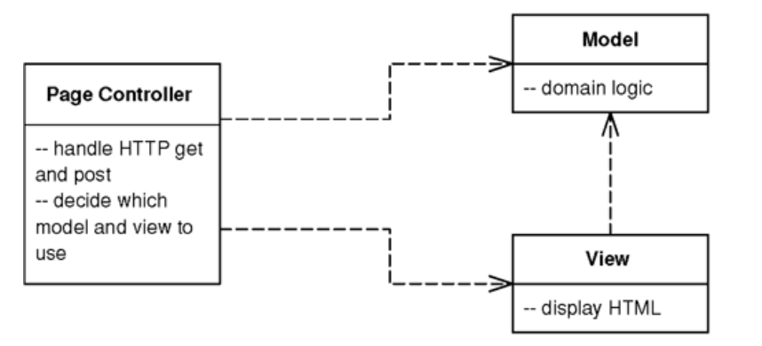

# Page Controller

> An object that handles a request for a specific page or action on a Web site.

* Overview
* How It Works
* When to Use It

## Overview

*Page Controller* has one input controller for logical page of a web site. That controller may be the page itself, as it often is in server page environments, or it may be a separate object that corresponds to that page.

## How It Works

* There are three basic responsibilities for a *Page Controller*:

  * Decode the URL and extract any form data to figure out all the data for the action.

  * Create and invoke any model object to process the data. All relevant data from the HTML request should be passed to the model.

  * Determine which view should display the result page and forward the model information to it.

* Have one module on the web server act as the controller for each page on the web site. More strictly, the controllers tie in to each *action*, which may be clicking a link or a button.

* It can be structured either as a *script* or as a *server page*.
  * Using a server page usually combines the *Page Controller* and a *Template View* in the same file.
  * Using a script can involve the server page calling a helper object to handle all the logic, or make a script the handler and controller, so that the web server passes control to the script and it finally forwards to an appropriate view.
  * You can have some URLs handled by server pages and some by scripts. Any URLs that have little or no controller logic are best handled with a server page, since that provides a simple mechanism.

## When to Use It

The main decision is whether to use *Page Controller* or *Front Controller*. It's not uncommon to have a site where some requests are dealt with one and some with the other.

* *Page Controller* is the most familiar to work with and leads to a natural structuring mechanism where particular actions are handled by particular server pages or script classes. Your trade-off is thus the greater complexity of *Front Controller* against its various advantages, most of which make a difference in web sites that have more navigational complexity.

* *Page Controller* works particularly well in a site where most of the controller logic is pretty simple.
