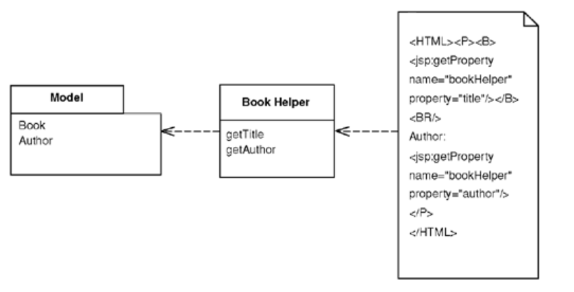

# Template View

> Renders information into HTML by embedding markers in an HTML page.

* Overview
* How It Works
* When to Use It
  * Weaknesses
  * Avoid Scriplets & Conditionals When Possible

## Overview



For working with **dynamic Web pages**, those that take results of something like database queries and embed them into the HTML, a good approach is to compose the dynamic Web page as you do **a static page but put in markers that can be resolved into calls to gather dynamic informationi**.

## How It Works

* **Emmbeding markers** into a static HTML page.
  * HTML-like tags.
  * Special text makers in the body text.
  * Server page (e.g., ASP, JSP or PHP), which allows embedding arbitrary programming logic (*scriplets*).

* When the page is used to service a request, the **markers are replaced by the results of some cmoputation**, such as a database query.

* A **Helper Object** that has all the real programming logic can be provided to each page. The simplest markers are easily translated into calls to the *helper* that result in text.

* **Conditional Display** can be useful but you start going down the path of turning the templates into a programming language in and of themselves, leading you into all the same problems you facen when you embed scriplets.
  * You can move the conditional logic into the *helper object*.
  * Moving markup logic to the helper object can be done at the cost of moving this choices away from the page designer and giving it to the programming code.

* **When to Process**: The primary function of this pattern is to play the view in *Model View Controller*. In simpler systems it may be reasonable for it to play the controller. Where *Template View* is taking on responsibilities beyond the view, it's important to ensure that these responsibilities are handled by the *helper*, not by the page. The template system needs **extra processing** that can either be done by **compiling the page after it's created**, **compiling the page on its first request**, **or by interpreting the page on each request**.

* **Exceptions**: If an exception works its way up to the web container, you may find yourself with a half-handled page that provides some odd output instead of a redirect. YOu need to look into how your web server handles exceptions. One approach would be to catch all exceptions yourself in the *helper* class.

## When to Use It

* For implementing the view in *Model View Controller* the main choice is between *Template View* and *Transform View*.

* Its strength is that it **allows you to compose the content** of the page **by looking at the page structure**.

* Supports the idea of a graphic designer laying out a page with a programmer working on the helper.

### Weaknesses

*** You need good discipline** to keep the page simple and display oriented, putting logic in the helper.

* It is **harder to test** than *Transform View*. Most implementations are designed to work within a Web server and are very difficult to test otherwise.

* *Two Step View* may be easier to implement based on a *Transform View* depending on your template scheme.

### Avoid Scriplets & Conditionals When Possible

* Eliminates the possibility of nonprogrammers editing the page.

* Poor module for a program. The page construct loses you most of the structural features that make it possible to do a modular design.

* Makes it too easy to mingle the different layers of an enterprise applications. When domain logic starts turning up on server pages, it becomes far too difficult to structure it well and far too easy to duplicate it across different server pages.

* When *conditions* are wanted for markup choices such as highlighting, in order to keep the choice of HTML in the hands of the page design, you can use a **focused tag**.

```html
<!-- Avoid this! -->
<IF expression="isHighSelling()"><BOLD></IF>
<property name="price"/>
<IF expression="isHighSelling()"></BOLD></IF>

<!-- Do this instead -->
<highlight condition="isHighSelling" style="bold">
  <property name="price"/>
</highlight>
```
