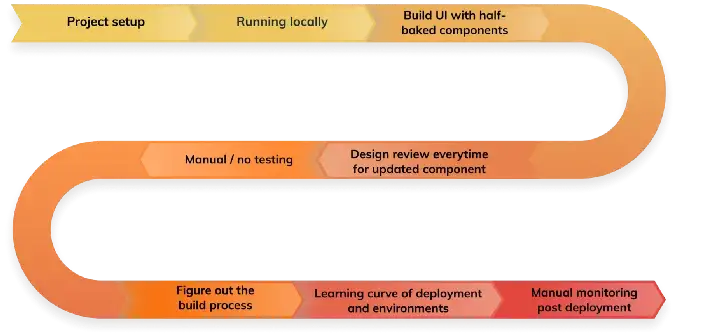
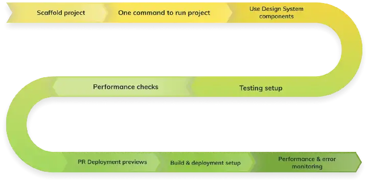

# Legacy lifecycle of frontend

- [Legacy lifecycle of frontend](#legacy-lifecycle-of-frontend)
  - [Legacy workflow](#legacy-workflow)
    - [Problems](#problems)
      - [Lack of infra standarization](#lack-of-infra-standarization)
      - [Lack of design consistency](#lack-of-design-consistency)
      - [Complicated release management](#complicated-release-management)
      - [Lack of testing framework](#lack-of-testing-framework)
      - [Complicated local environment setup](#complicated-local-environment-setup)
  - [Ideal workflow](#ideal-workflow)

## Legacy workflow

### Problems

#### Lack of infra standarization

Redundant effort to setup build and deployment. Individual project owners have to invest a lot of time into these aspects.

#### Lack of design consistency

Redundancies like components carrying the same intent but having different variations (e.g., buttons, input fields, colors, etc.).

#### Complicated release management

Complicated builds and deployments relying on IDs, commit hashes, shell scripts, and fragile CI configuration. Lack of observability tools for predictable error and performance monitoring with no SLI/SLAs.

#### Lack of testing framework

Lack of testing infra, redundant effort in setting up tests, high friction for unit/integration testing.

#### Complicated local environment setup

High learning curve for setting up a project, local envs taking a long time to build, missing project guidelines.

## Ideal workflow

