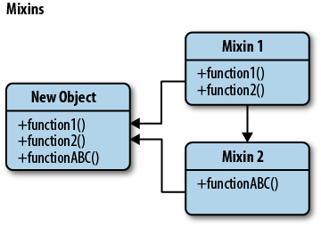

# Mixin Class

Class that is intended to __provide an optional interface or functionality to other classes__, without having to be the parent class of those. How those other classes gain access to the mixin's method depends on the languge.

It's similar to an abstract class in that it's __not intended to be instantiated__.

Mixin classes require Multiple Inheritance, and are sometimes described as being "_included_" rather than "_inherited_".

Mixins encourage code reuse and can be used to avoid the inheritance ambiguity that multiple inheritance can cause (__The diamond problem__), or to work around lack of support for multiple inheritance in a language.

## Definition

Mixins are a language concept that allows a programmer to inject some code into a class. Units of functionality are created in a class and then mixed in with other classes.

A Mixin Class acts as the parent class, containing the desired functionality. A Subclass can then inherit or simple reuse this functionality, but not as a means of specialization. Typically, the mixin will export the desired functionality to a child class, without creating a rigid, single "is a" relationship. Here lies the important difference between the concepts of mixins and inheritance, in that the child class can still inheirt all the features of the parent class, but, the semantincs about the child "being a kind of" the parent need not be necessarily applied.

## Advantages

1. Provides a mechanism for Multiple Inheritance by allowing multiple classes to use the common functionality, but without the complex semantic of multiple inheritance.
2. Code Reusability: Mixins are useful when a programmer wants to share functionality between different classes. Instead of repeating the same code, the common functionality can simple be grouped into a Mixin and then included into each class that requires it.
3. Mixins allow inheritance and use of only the desired features from the parent class, not necessarily all of them.

## Examples

* [JavaScript Mixins](https://javascript.info/mixins)
* [Python Mixins](https://stackoverflow.com/questions/533631/what-is-a-mixin-and-why-are-they-useful)
