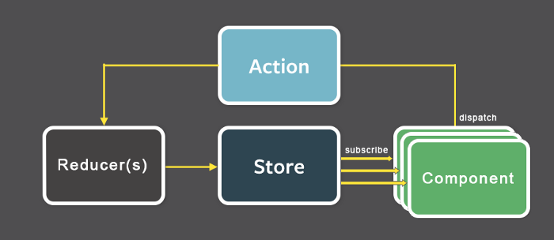

# Flux Comparison

> Resources:
> * https://medium.com/@dakota.lillie/flux-vs-redux-a-comparison-bbd5000d5111
> * https://www.clariontech.com/blog/mvc-vs-flux-vs-redux-the-real-differences

## Flux Data Flow

> See [Flux introduction](../../architectures/flux)

## Redux Data Flow

## Comparison

* No Dispatcher
* Single, Less Convoluted Store
* Reducers

> There are multiple frameworks/libraries that can be used to implement Flux. But Redux has distinguished itself as the one of the most populars.

Co-authored by _dan Abramov_ and _Andrew Clark_ in 2015, Redux aims to __simplify and streamline many of the concepts introduced by Flux__.

Redux and Flux are __similar in that they both emphasize the importance of unidirectional data flow, and they both adjust state through actions__ with a similar interface (such as having a `type` field). However, they have some differences to note:

* __No Dispatcher__: Redux has a single store, so there is only a single destination to broadcast new actions to, thus eliminating the need for a dispatcher.

* __A Single, Less Convoluted Store__: All application's state is located within a centralized store which acts as the application's single source of truth. Additionally, the store's responsibilities have been reduced, it is now only responsible for containing the state, and is no longer in charge of determining how to adjust its state in response to actions. That logic has been delegated to _reducers_.

* __Reducers__: _Pure functions_ which accept the current state and a given action as arguments, and which output either the unmodified state or a new, edited copy of the state. Redux considers _state to be immutable_.
