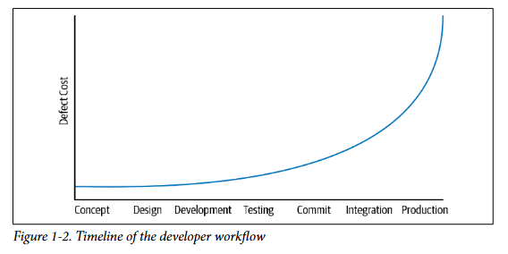

# Shifting Left

> This term seems to have originated from arguments that security mustn't be deferred until the end of the development process, with requisite calls to *"shift left on security"*.

The argument in this case is relatively simple: if a security problem is discovered onlyafter your product has gone to production, you have a very expensive problem. If it iscaught before deploying to production, it may still take a lot of work to identify andremedy the problem, but it’s cheaper. If you can catch it before the original developercommits the flaw to version  control, it’s even  cheaper: they already have an under‐standing of the feature; revising according to new security constraints is cheaper thancommitting and forcing someone else to triage it and fix it.

Bugs that are caught bystatic analysis and code review before they are committed are much cheaper thanbugs that make it to production. Providing tools and practices that highlight quality, reliability, and security early in the development process is a common goal for manyof our infrastructure teams. No single process or tool needs to be perfect, so we can assume a  **defense-in-depth  approach,  hopefully  catching  as  many  defects  on  the  leftside of the graph as possible**.
