# Design a Chat System

* Overview
* Step 1: Understand the problem and establish design scope
* Step 2: Propose high-level design and get buy-in
* Step 3: Design deep dive
* Step 4: Wrap up

## Overview

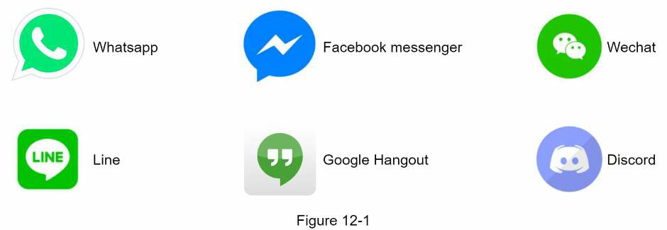

A chat app performs different functions for different people. It is extremely important to nail down the exact requirements. For example, we don't want to design a system that focuses on group chat when the interviewer has one-on-one chat in mind. It is important to explore the feature requirements.

## Step 1: Understand the problem and establish design scope

### Q&A

At the very least, figure out if you should focus on a one-on-one chat or group chat app.

**Candidate**: What kind of chat app shall we design? 1 on 1 or group based?
**Interviewer**: It should support both 1 on 1 and group chat.

**Candidate**: Is this a mobile app? Or a web app? Or both?
**Interviewer**: Both.

**Candidate**: What is the scale of this app? A startup app or massive scale?
**Interviewer**: It should support 50 million daily active users (DAU).

**Candidate**: For group chat, what is the group member limit?
**Interviewer**: A maximum of 100 people.

**Candidate**: What features are important for the chat app? Can it support attachment?
**Interviewer**: 1 on 1 chat, group chat, online indicator. The system only supports text messages.

**Candidate**: Is there a message size limit?
**Interviewer**: Yes, text length should be less than 100,000 characters long.

**Candidate**: Is end-to-end encryption required?
**Interviewer**: not required for now but we will discuss that if time allows.

**Candidate**: How long shall we store the chat history?
**Interviewer**: Forever.

### Outcome

We will focus on designing a chat app like Facebook messenger, with an emphasis on the following features:

* A one-on-one chat with low delivery latency.
* Small group chat (max of 100 people).
* Online presence.
* Multiple device support. The same account can be logged in to multiple accounts at the same time.
* Push notifications.
* Support 50 million DAU.

## Step 2: Propose high-level design and get buy-in

In a chat system, clients can be either mobile applications or web applications. Clients do not communicate directly with each other. Instead, each client connects to a chat service, which supports all the features mentioned above.

We'll focus on supporting the following functions:

* Receive messages from other clients.
* Find the right recipients for each message and relay the message to the recipients.
* If a recipient is not online, hold the messages for that recipient on the server until he is online.

When a client intends to start a chat, it connects the chats service using one or more network protocols. For a chat service, the choice of network protocols is important.

Requests are initiated by the sender side of a the application. In this scenario, the client opens a HTTP connection with the chat service and sends the message, informing the service to send the message to the receiver. The keep-alive is efficient for this because the keep-alive header allows a client to maintain a persistent connection with the chat service and reduces the number of TCP handshakes.

### Polling

The client periodically asks the server if there are messages available. Depending on polling frequency, polling can be costly. It could consume precious server resources to answer a question that offers no as an aswer most of the time.

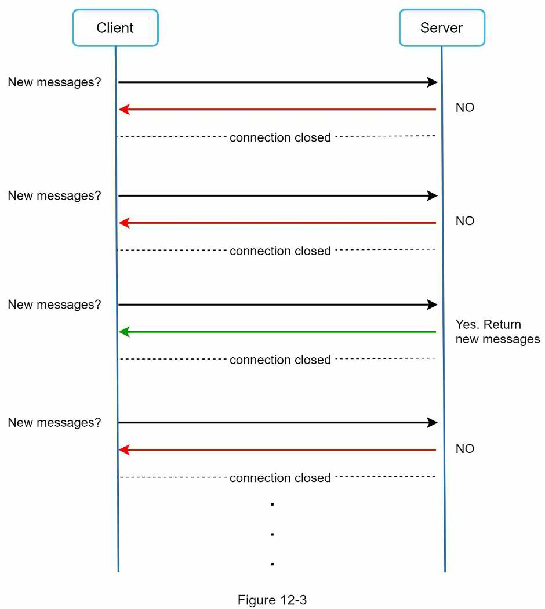

### Long Polling

Because polling could be inefficient, the next progression is long polling.

In long polling, a client holds the connection open until there are actually new messages available or a timeout treshold has been reached. Once the client receives new messages, it immediately sends another request to the server, restarting the process.

Long polling has a few drawbacks:

* Sender and receiver may not connect to the same chat server. HTTP based servers are usually stateless. If you use round robin for load balancing, the server that receives the message might not have a long-olling connection with the client who receives the message.

* A server has no good way to tell if a client is disconnected.

* It is inefficient. If a user does not chat much, long polling still makes periodic connections after timeouts.

### WebSocket

WebSocket is the most common solution for sending asynchronous updates from server to client.

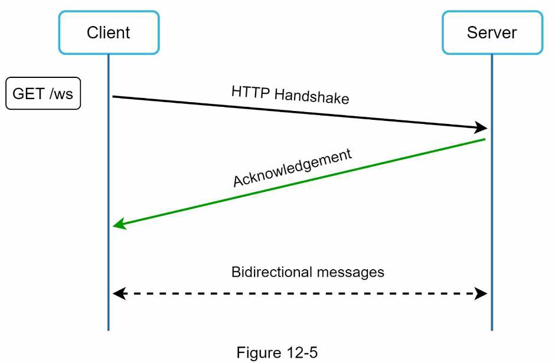

WebSocket connection is initiated by the client. It is bi-directional and persistent. It starts its life as a HTTP connection and could be "upgraded" via some well-defined handshake to a WebSocket connection. Through this persistent connection, a server could send updates to a client.

> WebSocket connections generally work even if a firewall is in place. This is because they use port 80 or 443 which are also used by HTTP/HTTPS connections.

Earlier we said that on the sender side HTTP is a fine protocol to use, but since WebSocket is bidirectional, there is no strong technical reason not to use it also for sending.

By using WebSocket for both sending and receiving, it simplifies the design and makes implementation on both client and server more straightforward. Since WebSocket connections are persistent, efficient connection management is critical on the server-side.

### High-level design

Most features (sign up, login, user profol, etc) of a chat application could use the tradditional request/response method over HTTP, while WebSocket was chosen as the main communication protocol for bidirectional communication.

The chat system is broken down into three major categories: stateless services, stateful services, and third-party integration.

### Stateless Services

Stateless services are traditional public-facing request/response services, used to manage the login, signup, user profile, etc. These are common features among many websites and apps. A load balancer routes requests to the correct services based on the request paths.

The one service that we will discuss more in deep is the service discovery. Its primary job is to give the client a list of DNS host names of chat servers that the client could connect to.

### Stateful Service

The only stateful service is the chat service. The service is stateful because each client maintains a persistent network connection to a chat server. In this service, a client normally does not switch to another chat server as long as the server is still available. The service discovery coordinates closely with the chat service to avoid server overloading.

### Third-party integration

For a chat app, push notifications is the most important third-party integration. It is a way to inform when new messages have arrived, even when the app is not running. Refer to [design a notification system](../notification-system) for more information.

### Scalability

The number of concurrent connections that a server can handle will most likely be the limitating factor. In our scenario, at 1M concurrent users, assuming each user connection needs 10K of memory on the server (very rough figure and very dependent on the language choice), it only needs about 10GB of memory to hold all the connections on one box.

No technologist would propose a design where everything fits in one server. It is a deal breaker due to many factors. The single point of failure is the biggest among of them. However, it is perfectly fine to start with a single server design and make clear that this is a starting point.

### High level proposal

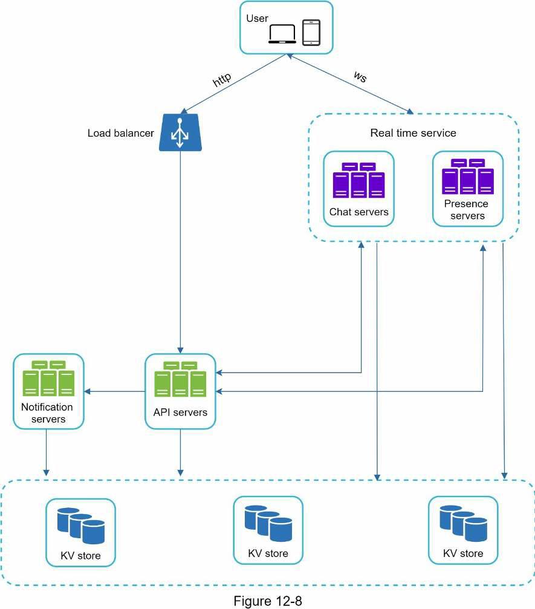

* Chat servers facilitate message sending/receiving.
* Presence servers manage online/offline status.
* API servers handle everything including user login, signup, change profile, etc.
* Notification servers send push notifications.
* Finally, the key-value store is used to store chat history. When an offline user comes online, he will see al his previous chat history.

### Storage

An important decision we must take is to decide on the right type of database to use.

Two types of data exist in a typical chat system. The first is generic data, such as user profile, setting, user friends list. These data are stored in robust and reliable relational databases. Replication and sharding are common techniques to satisfy availability and scalability requirements. The second is unique to chat systems, **chat history data**. It is important to understand the read/write pattern:

* The amount of data is enormous for chat systems. A previous study reveals that Facebook messenger and Whatsapp process 60 billions messages a day.
* Only recent chats are accessed frequently. Users do not usually look up for old chats.
* Although very recent chat history is viewed in most cases, users might use features that require random access of data, such as search, view your mentions, jump to specific messages, etc. These cases should be supported by the data acess layer.
* The read to write ratio is about 1:1 for 1 on 1 chat apps.

We recommend key-value stores for chat history data for the following reasons:

* Key-value stores allow easy horizontal scaling.
* Key-value store provide very low latency to access data.
* Relational databases do not handle long tail of data well. When the indexes grow large, random access is expensive.
* Key-value stores are dopted by other proven reliable chat applicationsj (e.g., Facebook messenger uses HBase, and Discord uses Cassandra).

#### Data model - 1 on 1 chat

There's a message table for 1 on 1 chat. The primary key is `message_id`, which helps to decide message sequence. We cannot rely on `created_at` for this because two messages can be created at the same time.

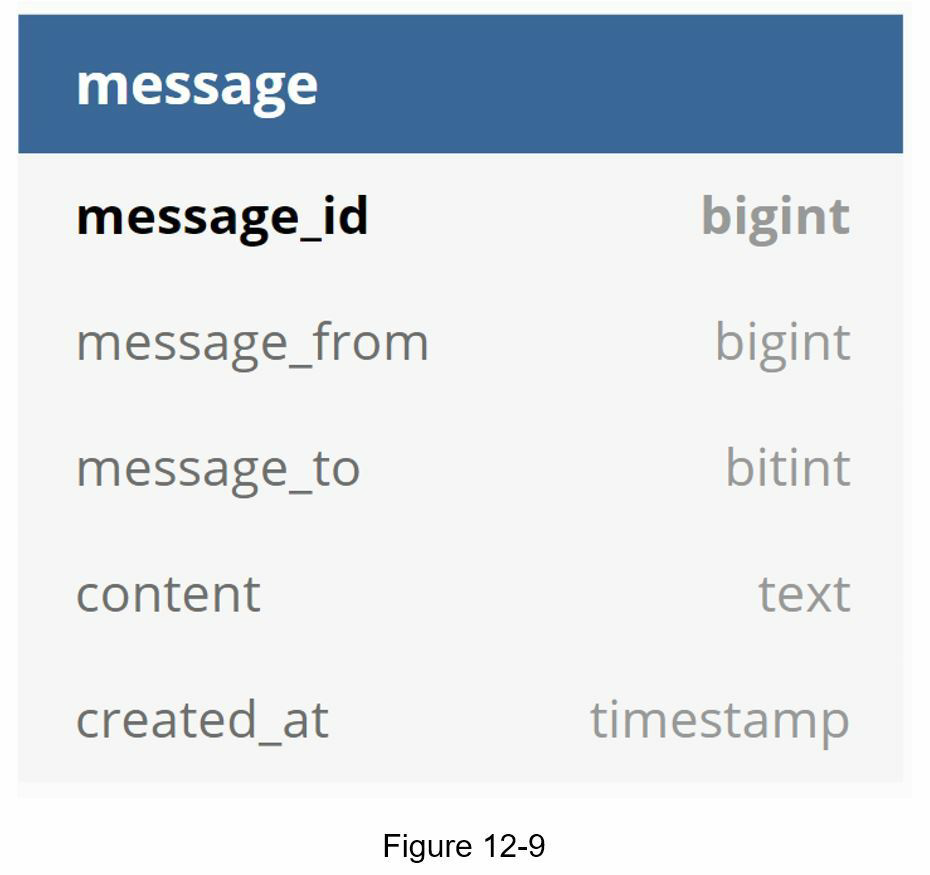

#### Data model - Group chat

There's another message table for group chat. The composite primary key is `(channel_id, message_id)`. Channel and group represent the same meaning here. `channel_id` is the partition key because all queries in a group chat operate in a channel.

#### Message ID

`message_id` carries the responsibility of ensuring the order of messages. To ascertain the order of messages, it must satisfy two requirements:

* IDs must be unique.
* IDs should be sortable by time, meaning new rows have higher IDs than old ones.

If we are going to use a key-value (NoSQL) database, it usually does not provide an *auto_increment* feature. The second approach is to use a global 64-bit sequence number generator like *Twitter Snowflake*.

The final approach is to use a *local sequence number generator*. Local means IDs are only unique within a group. The reason why local IDs work is that maintaining message sequence within one-on-one channel or a group channel is sufficient. This approach is easier to implement in comparison to the global ID implementation.

## Step 3: Design deep dive

For the chat system, service discovery, messaging flows, and online/offline indicators worth deeper exploration.

### Service Discovery

The primary role of service discovery is to recommend the best chat server for a client based on the criteria like geographical location, server capacity, etc. *Apache Zookeper* is a popular open-source solution for service discovery. It registers all the available chat servers and picks the best chat server for a client based on predefined criteria.

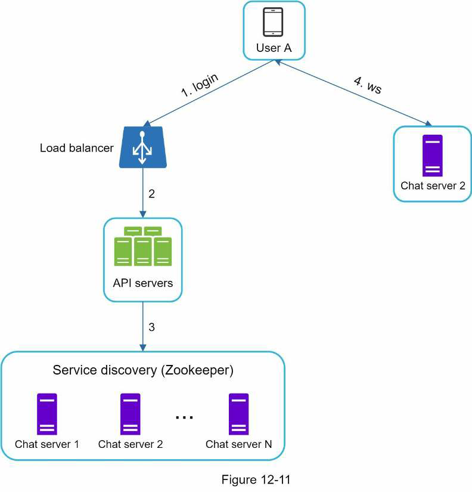

1. User A tries to log in to the app.
2. The load balancer sends the login request to API servers.
3. AFter the backend authenticates the user, service discovery finds the best chat server for User A. In this example, server 2 is chosen and the server info is returned back to User A.
4. User A connects to chat server 2 through WebSocket.

### Message flows

We will explore 1 on 1 chat flow, message synchronization across multiple devices and group chat flow.

#### 1 on 1 chat flow

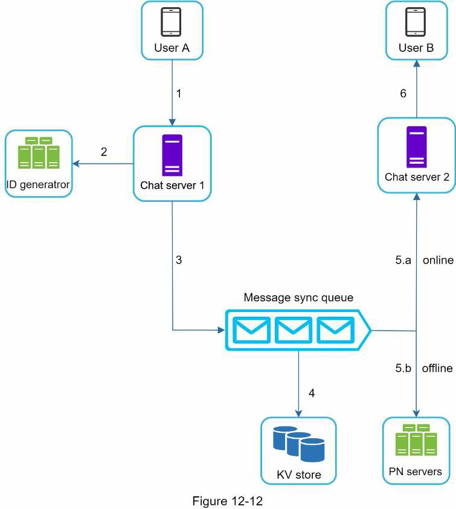

1. User A sends a chat message to Chat server 1.
2. Chat server 1 obtains a message ID from the ID generator.
3. Chat server 1 sends the message to the message sync queue.
4. The message is stored in a key-value store.
5. (A) If User B is online, the message is forwarded to Chat server 2 where User B is connected. (B) If User B is offline, a push notification is sent from push notification (PN) servers.
6. If 5.A, then chat server 2 forwards the message to User B. There is a persistent WebSocket connection between User B and Chat server 2.

#### Message synchronization across multiple devices

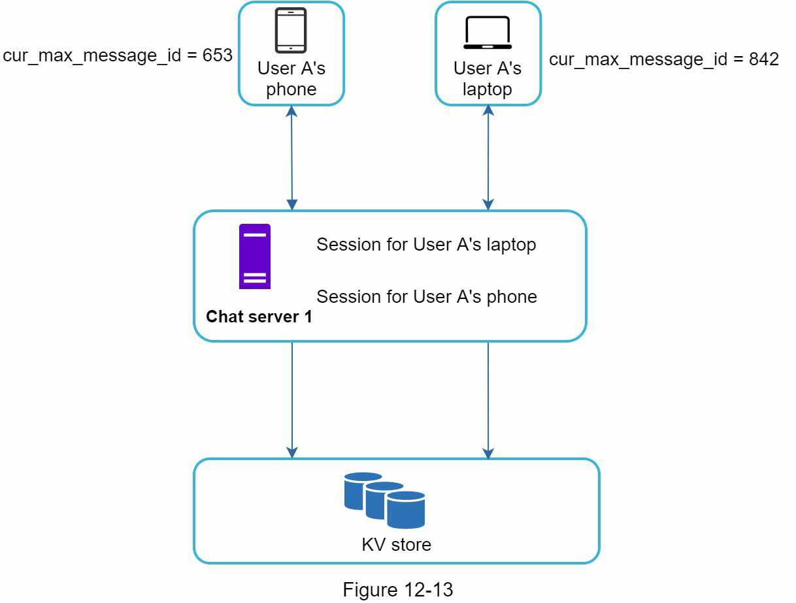

Suppose User A has two devices: a phone and a laptop. When User A logs in to the chat app with her phone, it establishes a WebSocket connection with Chat server 1. Similarly, there is a connection between the laptop and Chat server 1.

Each device maintains a variable called `cur_max_message_id`, which keeps track of the latest message ID on the device. Messages that satisfy the following conditions are considered as news messages:

* The recipient ID is equal to the currently logged-in user ID.
* Message ID in the key-value store is larger than `cur_max_message_id`.

With distinct `cur_max_message_id` on each device, message synchronization is easy as each device can get new messages from the KV store.

#### Small group chat flow

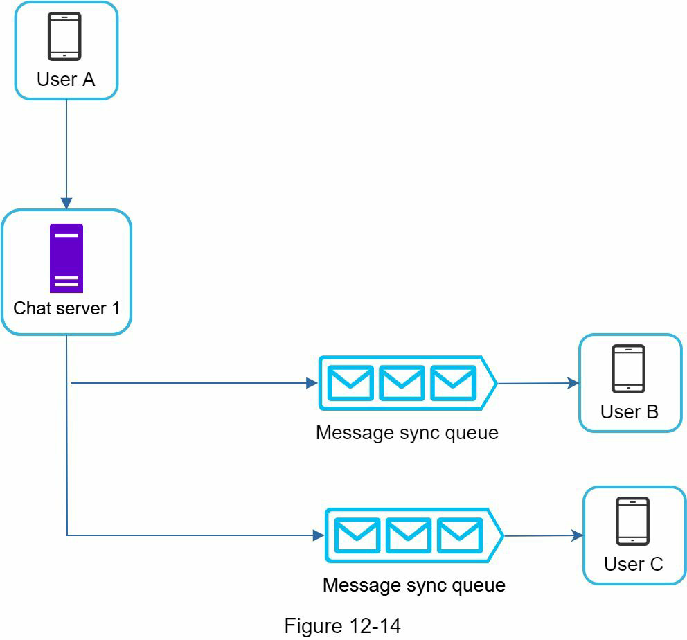

Assume there are 3 members in the group (User A, User B and User C). First, the message from User A is copied to each group member's message sync queue. You can think of the message sync queue as an inbox for a recipient. This design choice is good for small group chat because:

* It simplifies message sync flow as each client only needs to check its own inbox to get new messages.
* When the group number is small, storing a copy in each recipient's inbox is not too expensive. However, for groups with a lot of users, this approach is no longer acceptable.

> WeChat uses a similar approach, and it limits a group to 500 members. 

On the recipient side, a recipient can receive messages from multiple users. Each recipient has an inbox (message sync queue) which contains messages from different senders.

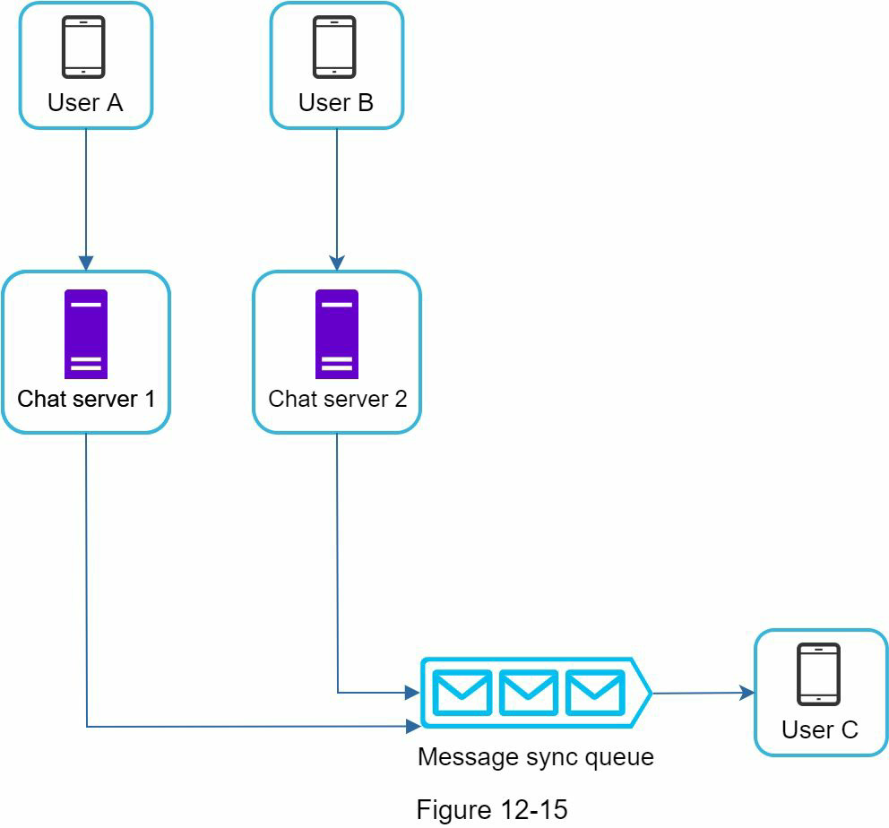

### Online Presence

An online presence indicator is an essential feature of many chat applications. Usually, you can see a green dot next to a user's profile picture or username.

In the high-level design, presence servers are responsible for managing online status and communicating with clients through WebSocket. Here are a few flows that will trigger online status change.

#### User login

After a WebSocket connection is built between the client and the real-time service, User A's online status and `last_active_at` timestamp are saved in the KV store.

#### User logout

When a user logs out, it goes through the user logout flow. The online status is changed to offline in the KV store.

#### User disconnection

When a user disconnects from the internet, the persistent connection between the client and server is lost. A naive way to handle user disconnection is to mark the user as offline and change the status to online when the connection re-establishes. However, this approach has a major flaw. It is common for users to disconnect and reconnect to the internet frequently in a short time when connection is unstable, and changing the presence indicator too often would result in poor user experience.

We introduce a heartbeat mechanism to solve this problem. Periodically, an online client sends a heartbeat event to presence servers. If presence servers receive a heartbeat event within a certain time, say x seconds from the client, a user is considered as online. Otherwise, it is offline.

> The client sends a heartbeat event to the server every 5 secods. AFter sending 3 heartbeat events, the client is disconnected and does not reconnect within x = 30 seconds. The online status is changed to offline.

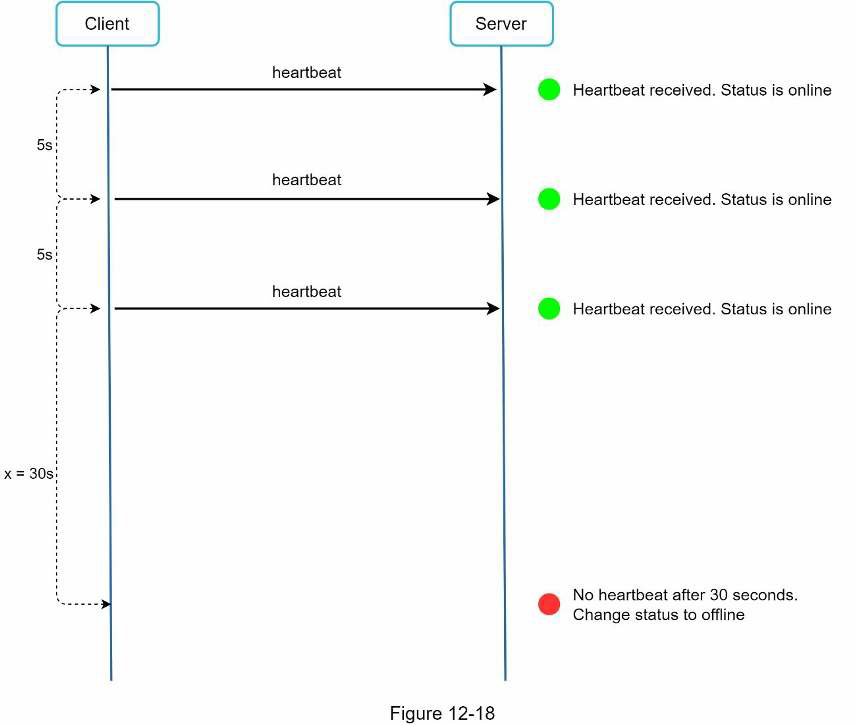

#### Online status fanout

How do User A's friends know about the status changes? Presence servers use a publish-subscribe model, in which each friend pair maintains a channel. When User A's online status changes, it publishes the event to three channels, channel A-B, A-C, and A-D. Those three channels are subscribed by User B, C, and D, respectively. Thus, it is easy for friends to get online status updates. The communication between clients and servers is through real-time WebSocket.

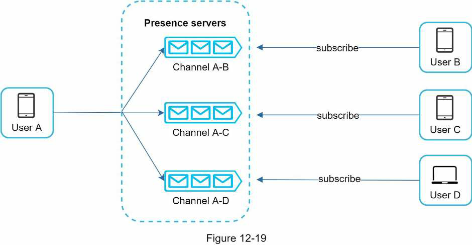

The above design is effective for a small user group. For larger groups, informing all members about online status is expensive and time consuming. To solve the performance bottleneck, a possible solution is to fetch online status only when a user enters a group or manually refreshes the friend list.

## Step 4: Wrap up

We presented a chat system architecture that supports both 1-to-1 chat and small group chat. WebSocket is used for real-time communication between the client and server. The chat system contains the following components: chat servers for real-time processing, presence servers for managing online presence, push notification servers for sending push notifications, key-value stores for chat history persistence and API servers for other functionalities.

Other points worth discussing:

* Extend the chat app to support media files such as photos and videos. Those are significantly larger than text in size. Compression, cloud storage, and thumbnails are interesting topics to talk about.

* End-to-end encryption. Only the sender and recipient can read messages.

* Caching messages on the client-side is effective to reduce the data transfer between the client and server.

* Improve load time. Slack built a grographically distributed network to cache users' data, channels, etc. for better load time.

* Error handling:
  * The chat server error. If a chat server goes offline, service discovery (i.e., *Zookeper*) will provide a new chat server for clients to establish new connections with.
  * Message resent mechanism. Retry and queueing are common techniques for resending messages.
