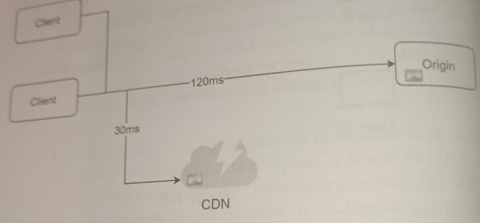
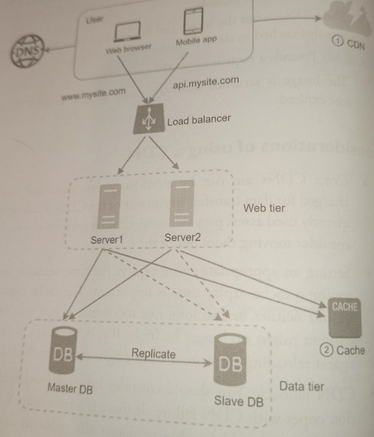

# Content Delivery Network

## Overview

A CDN is a network of geographically dispersed servers used to deliver static content. CDN servers cache static content like images, videos, text files, etc.

## Considerations

* **Cost**: CDNs are run by third-party providers and you are charged for data transfers in and out of the CDN.

* **Expiration policy**: Such as any other cache tier, it should neither be too long nor too short.

* **Fallback**: If there is a temporary CN outage, clients should be able to detect the problem and request resources from the origin. Otherwise CDN will be a SPOF.

* **Invalidating files**: You can remove a file from the CDN before it expires by performing one of the following operations:
  * Using APIs provided by CDN vendors.
  * Use object versioning to serve a different version of the object. To version an object, you can add a parameter to the URL, such as a version number.

## Example Architecture

