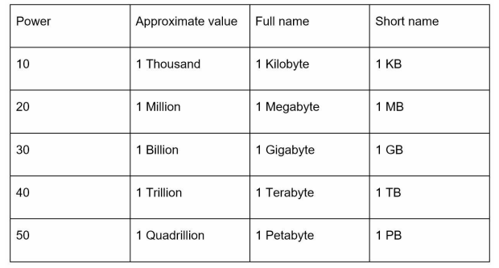

# Back-of-the-envelope Estimation

* Overview
* Must know
* Example: Estimate Twitter QPS and storage requirements
* Tips

## Overview

*Back-of the envelope estimation* estimates you create using a combination of thought experiments and common performance numbers to get a good feel for which designs will meet your requirements.

## Must know

* Power of Two
* Latency Numbers
* Availability numbers

### Power of Two

Although data volume can become enormous when dealing with distributed systems, calculation all boils down to the basics. To obtain correct calculations, it is critical to know the data volume unit using the power of two.

### Latency Numbers

Those are latency numbers every programmer should know. Some numbers may be outdated as computers become faster, however, they should still be able to give us an idea of the fastness and slowness of different computer operations.

| Operation Name                                   | Time                   |
|--------------------------------------------------|------------------------|
| L1 Cache reference                               | 0.5 ns                 |
| Branch mispredict                                | 5 ns                   |
| L2 cache reference                               | 7 ns                   |
| Mutex lock/unlock                                | 100 ns                 |
| Main memory reference                            | 100 ns                 |
| Compress 1K bytes with Zippy                     | 10,000 ns = 10 us      |
| Send 2K bytes over 1 Gbps network                | 20,000 ns = 20 us      |
| Read 1 MB sequentially from memory               | 250,000 ns = 250 us    |
| Round trip within the same datacenter            | 500,000 ns = 500 us    |
| Disk seek                                        | 10,000,000 ns = 10ms   |
| Read 1 MB sequentially from the network          | 10,000,000 ns = 10ms   |
| Read 1 MB sequentially from disk                 | 30,000,000 ns = 30 ms  |
| Send packet CA (California) -> Netherlands -> CA | 150,000,000 ns = 150ms |

> * ns = nanosecond = 10^-9 seconds
> * us = microsecond = 10^-6 seconds = 1,000 ns
> * ms = microsecond = 10^-3 seconds = 1,000 us = 1,000,000 ns

By looking at this numbers, we get the following conclusions:

* Memory is fast but the disk is slow.
* Avoid disk seeks if possible.
* Simple compression algorithms are fast.
* Compress data before sending it over the internet if possible.
* Data centers are usually in different regions, and it takes time to send data between them.

### Availability Numbers

High availability is the ability of a system to be continuously operational for a desirably long periof of time. High availability is measured as a percentage, with 100% means a service that has 0 downtime. Uptime is traditionally measured in nines. The more nines, the better.

> Most services fall between 99% and 100%

A *Service Level Agreement (SLA)* is a commonly used term for service providers. This agreement formally defines the level of uptime your service will decliver.

> Cloud providers Amazon, Google, and Microsoft, set their SLAs at 99.9% or above.

| Availability % | Downtime per day    | Downtime per week | Downtime per month | Downtime per year |
|----------------|---------------------|-------------------|--------------------|-------------------|
| 99%            | 14.40 minutes       | 1.68 hours        | 7.31 hours         | 3.65 days         |
| 99.9%          | 1.44 minutes        | 10.08 minutes     | 43.83 minutes      | 8.77 hours        |
| 99.99%         | 8.64 seconds        | 1.01 minutes      | 4.38 minutes       | 52.60 minutes     |
| 99.999%        | 864.00 milliseconds | 6.05 seconds      | 26.30 seconds      | 5.26 minutes      |
| 99.9999%       | 86.40 milliseconds  | 604.80 seconds    | 2.63 seconds       | 31.56 seconds     |

## Example: Estimate Twitter QPS and storage requirements

PLease note the following numbers are for this exercise only:

### Assumptions

* 300 million monthly active users.
* 50% of users use Twitter daily.
* Users post 2 tweets per day on average.
* 10% of tweets contain media.
* Data is stored for 5 years.

### Estimations

#### Query per second (QPS) estimate

* Daily active users (DAU) = 300 million * 50% = 150 million
* Tweets QPS = 150 million DAU * 2 tweets / 24 hour / 3600 seconds = ~3500
* Peak QPS = 2 * QPS = ~7000

#### Media storage estimate

* Average tweet size:
  * tweet_id 64 bytes
  * text 140 bytes
  * media 1 MB
* Media storage: 150 million DAU * 2 tweets * 10% * 1MB = 30TB per day
* 5-year media storage: 30 TB * 365 * 5 = ~55PB

## Tips

Solving the problem is more important than obtaining results:

* **Rounding and Approximation**. There is no need to spend valuable time to solve complicated math problems. Precision is not expected. Use round numbers and approximation.

* **Write down your assumptions**.

* **Label your units**. You might get confused if you only write down "5". Does it mean 5 KB or 5 MB?

* **Commonly asked estimations**: QPS, peak QPS, storage, cache, number of servers, etc.
