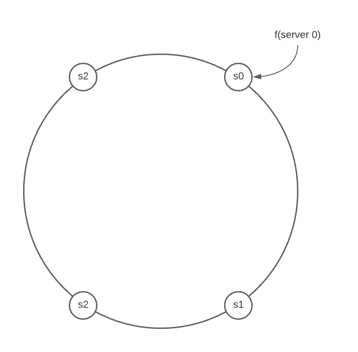
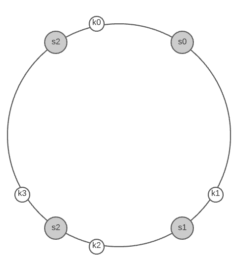
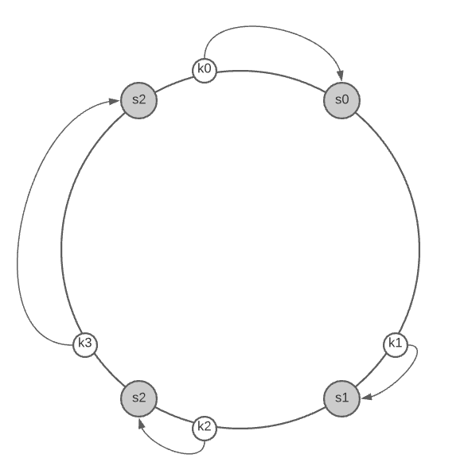
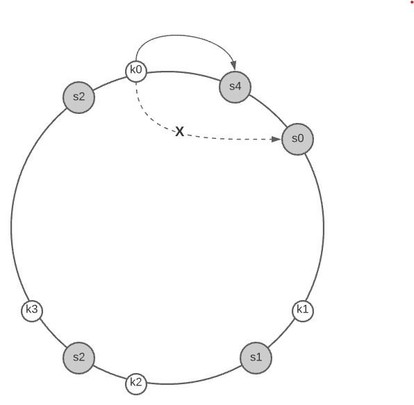
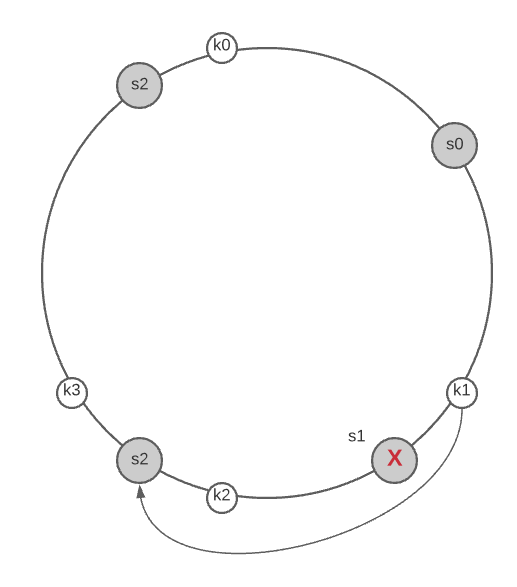
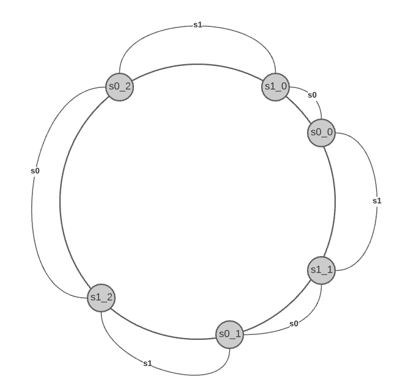
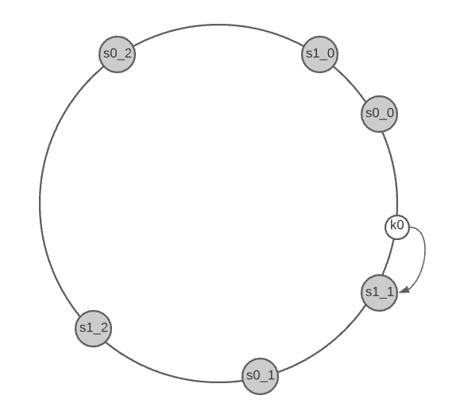

# Consistent Hashing

* Overview
* Hash space and hash ring
* Consistent Hash Servers
  * Server lookup
  * Remove a server
* Two issues in the basic approach
* A solution: Virtual nodes

## Overview

*Consistent hashing* is a special kind of hashing such that when a hash table is re-sized, only `k/n` keys need to be remapped to on average, where `k` is the number of keys, and `n` is the number of slots. In constrast, in most traditional hash tables, a change in the number of array slots causes nearly all keys to be remapped.

## Hash space and hash ring

Assume SHA-1 is used as the hash function $f$, and the output range of the hash function is: $x_0$, $x_1$, $x_2$, ..., $x_{n-1}$. In cryptography, SHA-1's hash space goes from 0 to $2^160 - 1$. That means $x_0$ corresponds to 0, $x_{n-1}$ corresponds to $2^160 - 1$, and all the other hash values in the middle fall between 0 and $2^160 - 1$.

## Consistent Hash Servers

Consistent hashing servers **minimize keys that need to be redistributed** when servers are added or removed. It is easy to scale horizontally because **data are more evenly distributed**.

Using the same *consistent hashing* hash function $f$, we map servers based on server IP or name onto the ring. The basic setps are:

* Map servers and keys on the ring using a uniformly distributed hash functions.

* To find out which server a key is mapped to, go clockwise from the key position until the first server on the ring is founded.

The following example shows that 4 servers are mapped on the hash ring.

> Consistent hashing is widely used in real-world systems, including partitioning component of *Amazon's Dynamo database*, data partitioning across the cluster in *Apache Cassandra*, *Discord* chat application, *Akami CDN*, *Maglev* network load balancer.

### Server lookup

To determine which server a key is stored on, we go clockwise from the key position on the ring until a server is found.

> Going clockwise, key0 is stored on server 0, key1 is stored on server 1, key2 is stored on server 2, and key3 is stored on server 3.

### Add a server

Adding a new server will only require redistribution of a fraction of keys with consistent hashing.

> After a new *server 4* is added, only *key0* needs to be redistributed. *k1*, *k2* and *k3* remain on the same servers. The other keys are not distributed based on consistent hashing algorithm.

To find the affected range of keys you start from the newly added node $s_{new}$ and then move anticlockwise around the ring until a server $s_x$ is found. Thus, the keys located between $s_{new}$ and $s_b$ need to be distributed to $s_{new}$.

### Remove a server

When a server is removed, only a small fraction of keys require distribution with consistent hashing.

> When *server 1* is removed, only *key1`* must be remapped to *server 2*. The rest of the keys are unaffected

To find the affected range of keys you start from the removed node $s_{removed}$ and moves anticlockwise around the ring until a server is found $s_x$. Thus, keys located between $s_x$ and $s_removed$ must be redistributed to $s_{next(removed)}$.

## Two issues in the basic approach

First, it is **impossible to keep the same size of partitions** on the ring for all servers considering a server can be added or removed.

> A partition is the hash space between adjacent servers.

It is possible that the size of the partitions on the ring assigned to each server is very small or fairly large.

Second, it is **possible to have a non-uniform key distribution** on the ring.

## A solution: Virtual nodes

A *virtual node* refers to the real node, and each server is represented by multiple virtual nodes on the ring. The

> Both *server 0* and *server 1* have 3 virtual nodes. This number is arbitrarily chosen; and in real-world systems, the number of virtual nodes is much larger. Instead of using $s0$, we have $s0_0$, $s0_1$, and $s0_2$ to represent *server 0* on the ring. Similarly for $s1$.

With virtual nodes, **each server is responsible for multiple partitions**. To find which server a key is stored on, we go clockwise from the key's location and find the first virtual node encountered on the ring.

As the number of virtual nodes increases, the **distribution of keys become more balanced**. This is because the standard deviation gets smaller with more virtual nodes, leading to balanced data distribution.

> Standard deviation measures how data are spread out.
