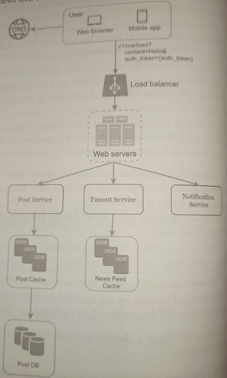
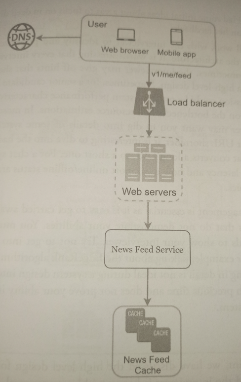
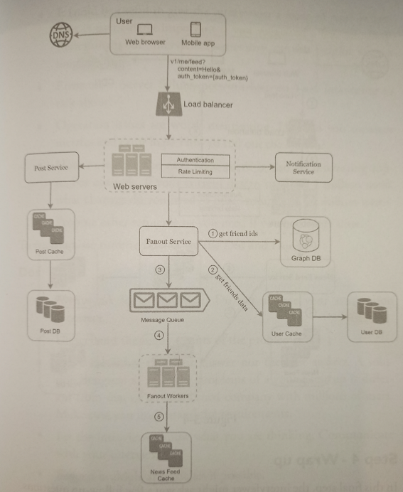
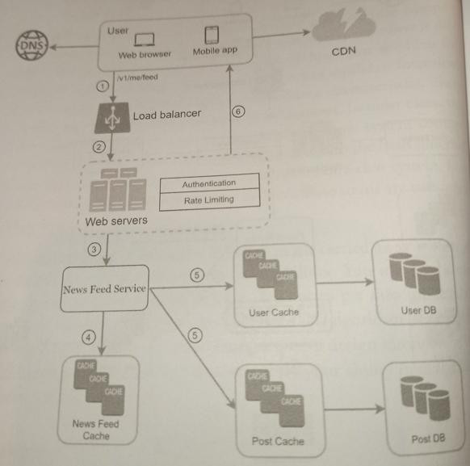

# A Framework for System Design Interviews

* Interview
* 4-step process
  1. Understand the problem and establish design scope
  2. Propose high-level design and get buy-in
  3. Design deep dive
  4. Wrap up
* Do's and Don'ts

---

## The Interview

System design problems are **open-ended**, and there is no perfect answer. They simulate real-life problem solving where two co-workers collaborate on an ambiguous problem and come up with a solution that meets their goals. The final design is less important compared to the work you put in the design process. This allows you to demonstrate your design skill, defend your design choices, and respond to feedback in a constructive manner.

An efective system design interview gives **strong signals about a person's ability to collaborate, to work under pressure, and to resolve ambiguity constructively**. The ability to ask good questions is also an essential skill, and many interviewers specifically look for this skill.

A good interviewer also looks for **red flags**. Over-engineering is a real disease of many engineers as they delight in design purity and ignore tradeoffs. They are often unaware of the compounding costs of over-engineered systems, and many companies pay a high price for that ignorance. Other red flags include narrow mindedness, stubbornnesss, etc.

---

## 4-step process

1. Understand the problem and establish design scope
2. Propose high-level design and get buy-in

### 1. Understand the problem and establish design scope (3 - 10 minutes)

Think deeply and ask questions to clarify requirements and assumptions. When you ask a question, the interviewer either answers your question directly or asks you to make your assumptions. If the latter happens, write down your assumptions.

> One of the most important skills as an engineer is to ask the right questions, make the proper assumptions, and gather all the information needed to build a system.

* What specific features are we going to build?

* How many users does the product have?

* How fast does the company anticipate to scale up?

* What are the anticipated scales in 3 months, 6 months, and a year?

* What is the company's technology stack? What existing services you might leverage to simplify the design?

#### Example

If you are asking to design a news feed system, you want to ask questions that help you clarify the requirements. The conversation between you and the interviewer might look like this:

**Candidate**: Is this a mobile app? Or a web app? Or both?
**Interviewer**: Both.

**Candidate**: What are the most important features for the product?
**Interviewer**: Ability to make a post and see friends' news feed.

**Candidate**: Is the news feed sorted in reverse chronological order or a particular order? The particular order means each post is given a different weight. For instance, posts from your close friends are more important than posts from a group.
**Interviewer**: To keep things simple, let us assume the feed is sorted by reverse chronological order.

**Candidate**: How many friends can a user have?
**Interviewer**: 5000

**Candidate**: What is the traffic volume?
**Interviewer**: 10 million daily active users (DAU)

**Candidate**: Can feed contain images, videos, or just text?
**Interviewer**: It can contain media files, including both images and videos.

### 2. Propose high-level design and get buy-in (10 - 15 minutes)

In this step, **we aim to develop a high-level design and reach an agreement** with the interviewer on the design. It is a great idea to collaborate with the interviewer during the process.

* Come up with an initial blueprint for the design. Ask for feedback. Treat your inteviwer as a teammate and work together.

* Draw box diagrams with key components. This might include clients (mobile/web), APIs, web servers, data stores, cache, CDN, message queue, etc.

* Do back-of-the-envelope calculations to evaluate if your blueprint fits the sacle constraints. Think out loud. Communicate with your interviewer if back-of-the-envelope is necessary before diving into it.

If possible, go through a few concrete use cases. This will help you frame the high-level design.

#### Example

Let's use *"Design a news feed system"* to demonstrate how to approach the high-level design.

At the high level, the design is divided into two flows:

* *Feed publishing*: when a user publishes a post, the data is written into cache/database, and the post will be populated into friends' news feed.

* *Newsfeed building*: the news feed is built by aggregating friends posts in a reverse chronological order.

### 3. Design deep dive (10 - 25 minutes)

At this step, you and your interviewer should have already achieved the following objectives:

* Agreed on the overall goals and feature scope.

* Sketched out a high-level blueprint for the overall design.

* Obtained feedback from your interviewer on the high-level design.

* Had some initial ideas about areas to focus on in deep dive based on feedback.

You should identify and prioritize components in the architecture. Every interview is different. For URL shortener, it is interesting to dive into the hash function design that converts a long URL to a short one. For a chart system, how to reduce latency and how to support online/offline status are two interesting topics.

#### Example

Extending on the news feed system example, we'll investigate two of the most important use cases:

1. Feed publishing

2. News feed retrieval

### Step 4 - Wrap up (3 - 5 minutes)

In this final step, you might get asked a few follow-up questions or get the freedom to discuss other additional points. Here are a few directions to follow:

* The interviewer might want you to **identify the system bottlenecks and discuss potential improvements**. There is always something to improve upon.

* It could be useful to give the interviwer a **recap** of your design.

* **Error cases** (server failure, network loss, SPOF) are interesting to talk about.

*  **Operation issues** are worth mentioning. How do you monitor metrics and error logs? How to roll out the system?

* How to handle **next scale curve** is also an interesting topic. For example, if your current design supports 1 million users, what changes do you need to make to support 10 million users?

* Propose other refinements you need if you had more time.

---

## Do's and Don'ts

### Do's

* Always ask for clarification. Do not assume your assumption is correct.

* Understand the requirements of the problem.

* Let others know what you are thinking.

* Suggest multiple approaches if possible.

* Once you get agreement on the blueprint, go into details on each component. Design the most critical components first.

* Bounce ideas off the interviewer.

### Don'ts

* Don't jump into a solution without clarifying the requirements and assumptions.

* Don't go into much detail on a single component in the beginning. Give the high-level design first then drill down.

* If you get stuck, don't hesitate to ask for hints.

* Don't think your interview is done once you give the design. Ask for feedbacke early and often.

