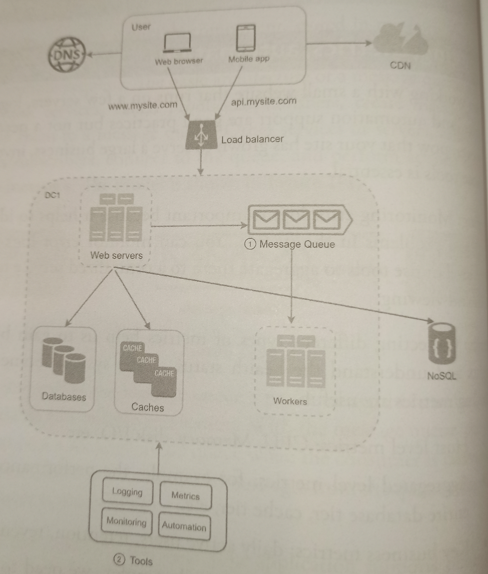

# Logging, metrics, automation

When your application has grown to serve a large business, logging, metrics and automation tools are essential.

* **Logging**: Monitoring errors logs helps to identify errors and problems in the system. YOu can monitor error logs at per server level or use tools to aggregate them to a centralized service for easy search and viewing.

* **Metrics**: Collecting different types of metrics help us to gain business insights and understand the health status of the system.
  * Host level metrics: CPU, Memory, disk I/O, etc.
  * Aggregated level metrics: Performance of entire database tier, cache tier, etc.
  * Key business metrics: Daily active users, retentions, revenue, etc.

* **Automation**: Build or leverage automation tools to improve productivity. Continuous integration allows teams to detect problems early. Automating build, test, deploy process, etc. could improve developer productivity significantly.

