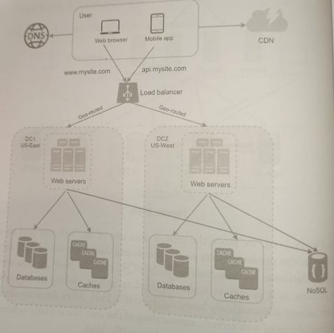
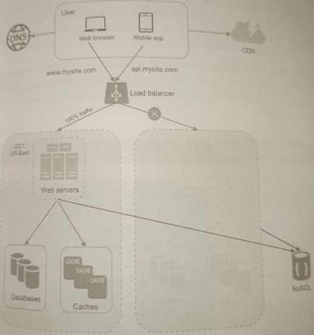

# Multi-data Center

In normal operations, users are *geoDNS-routed*, also known as *geo-routed* to the closest data center (e.g., with a split traffic of `x%` in US-East and `(100-x)%` in US-West).

In the event of any significant data center outage, we direct all traffic to a healthy data center.

Several technical challenges must be resolved to achieve multi-data center setup:

* **Traffic redirection**: Effective tools are needed to direct traffic to the correct data center. GeoDNS, Load Balancer, Health Checks, etc.

* **Data synchronization**: Users from different regions could use different local databases or caches. In failover cases, traffic might be routed to a data center where data is unavailable. A common strategy is to replicate data across multiple data centers.

> Research how Netflix implements asynchronous multi-data center replication.

* **Test and deployment**: It is important to test your application at different locations. Automated deployment tools are vital to keep services consistent through all the data centers.

* **Decoupled components**: To further scale our system, we need to decouple different components of the system so they can be scaled independently. Messaging queue is a key strategy employed by many real-word distributed systems for this.

